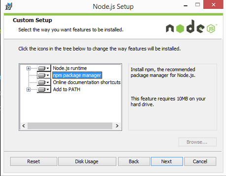

 
***

**Disclaimer:** This article is meant to enlighten. You are advised to research more on the subject matter. For further enquiries, send mail to eslintpurity@gmail.com or use the comment section below. Connect with me <a href = "http://www.github.com/eslintpurity">here</a> for freelancing or remote jobs. 
link for google form: https://zapier.com/learn/google-sheets/how-to-use-google-forms/
clean remote job offer: https://zapier.com/jobs/

<div class="alert alert-info" style="padding-top:2.2%; padding-bottom: 3%;"><div class="row"><div class="col-lg-2"></div>
<div class="col-lg-10"><h4 style = "font-size: 33px;">Introducing Laravel + Installation </h4>
<span style = "font-size: 18px; padding-top:100px;">A developer's guide to happy ending.</span><span style = "float:right;"> <i>Author: <span style = "color:teal;">Doyin-Elugbadebo...31st August, 2017</span></i><span></div></div>
</div>

<button class="accordion">Outline</button>
<div class="panel-accordion">
<p>

- Introduction</br>
- What is Flask?</br>
- Why use Flask?</br>
- Installation</br>
  -- Requirements</br>
  -- Installing pip, virtualenv and virtualenvwrapper</br>
  -- Installing Flask</br>
  -- Launching Flask</br>
- Templating</br>
- Common Installation Hitches</br>
- Resources
</p>
</div>

</br>

#### Introduction

***

In the early days of the dynamic web, programming a website or application meant writing the code for not just the unique business logic of your application, but also for each of the components that are so common across sites—user authentication, input validation, database access, templating, and more. Today, programmers have dozens of application development frameworks and thousands of components and libraries available for easy use. It’s a common refrain among programmers that, by the time you learn one framework, three newer (and purportedly better) frameworks have popped up intending to replace it.

So, why frameworks? And, more specifically, why Laravel?

<br>

#### Why Laravel?

***

What makes Laravel unique?
Taylor Otwell understood from the early days of Laravel that a successful open source project
needed two things: good documentation and a welcoming community. And those two things are now hallmarks of Laravel.

Things involved in dynamic web development
HTTP requests routing
routes configuration file. 
Dependency Injection Container to resolve the controllers and their dependencies. 
Impact on the next developer?

Developer happiness: Laravel is, at its core, about equipping and enabling developers. Its goal is to provide clear, simple, and beautiful code and features that help developers learn, start, and develop quickly and write code that’s simple, clear, and will last.

<br>

#### Why use a framework?

***

It’s easy to see why it’s beneficial to use the individual components, or packages, that are available to PHP developers. With packages, someone else is responsible for developing and maintaining a constrained piece of code that has a well-defined job, and in theory that person has a deeper understanding of this single component than you have time to have.
Frameworks like Laravel—and Symfony, Silex, Lumen, and Slim—pre-package a collection of third-party components together with custom framework “glue” like configuration files, service providers, prescribed directory structures, and application
bootstraps. So, the benefit of using a framework in general is that someone has made decisions not just about individual components for you, but also about how those components should fit together.

<br>

#### Consistency + Flexibility

***

Rapid Application Development

Additionally, frameworks provide conventions that reduce the amount of code a developer new to the project has to understand—if you understand how routing works in one Laravel project, for example, you understand how it works
in all Laravel projects.

Prior to Laravel’s rise to popularity, David Heinemeier Hansson released the first version of Ruby on Rails in 2004, and it’s been hard to find a web application framework since then that hasn’t been influenced by Rails in some way. Rails popularized MVC, RESTful JSON APIs, convention over configuration, Active-Record, and many more tools and conventions that had a profound influence on other frameworks

<br>

#### Other PHP Frameworks

*** 

CakePHP was the first in 2005, and it was soon followed by Symfony, CodeIgniter, Zend Framework, and Kohana (a CodeIgniter fork). Yii arrived in 2008, and Aura and Slim in 2010. 2011 brought Fuel, another CodeIgniter fork, and Laravel. **Laravel 5:** Laravel 5 introduced a revamped directory structure, removal of the form and HTML helpers, the introduction of the Contract interfaces, a spate of new views, Socialite for social media authentication, Elixir for asset compilation, Scheduler to simplify cron, dotenv for simplified environment management, Form Requests, and a brand new CLI.

The philosophy of Laravel: You only need to read through the Laravel marketing materials and READMEs to quickly gather its values. “Illuminate.” “Spark.” And then there are these: “Artisans.” “Elegant.” Also, these: “Breath of Fresh Air.” “Fresh start.” And finally: “Rapid.” “Warp Speed.”

The two most strongly communicated values of the framework are to increase developer speed and happiness. 

<br>

#### What is Laravel?

***

Moreover, in this document, I assume that readers have some basic understanding about web development.

Laravel is a clean and well-structured web framework for PHP development. According to its author, Laravel is “The PHP framework for Web artisans”. Laravel is also built on top of Symfony HTTP foundation, which is a solid, flexible and testable HTTP foundation for PHP application. 

In modern IT industry, it is essential for web developers to know at least one battle-proven framework. Laravel is one of the most successful PHP framework in 2015, based on annual framework popularity survey conducted by SitePoint (SitePoint, The Best PHP Framework for 2015: SitePoint Survey Results, cited, 25.10.2015).

<br>

#### Why Laravel?

***

There are several advantages and benefits of using web framework in general and Laravel in particular. 
- Framework is a product of collective intelligence, comprising many robust libraries and convenient tools from other developers. They help to reduce most of the repetitive tasks and complex tasks in simple interface, which means developers can write less and do more wit highest quality in a certain amount of time. Therefore, using a reliable framework also help to lower the development cost. 
- Furthermore, using a robust web framework also helps to strengthen the security of the application. Laravel support several features to prevent basic security vulnerabilities such as SQL injection, cross-site request forgery (CRF) and cross-site scripting (XSS).
- Moreover, Laravel also provides a well-structured skeleton for better code representation and building big projects. Basically, Laravel employ the famous MVC architectural pattern, which helps organizing code better. MVC pattern separate the business logic (models), the control coordination (controllers) and the presentation of data (views) into 3 different layers. 
- Basically, Laravel is a fully MVC-compliant framework. The framework come along with Eloquent, a simple ORM and blade templating language that helps developers build website in shorter time and less effort

The main outcome of this thesis is to build a movie review website which allow users give ratings for their favorite movies, browsing movies by genres and searching for a movie. In order to give review or rating, guest must open an account and login to the system. In the backend side, administrators can also create and manage new genres, movies, reviews and users. The motivation behind this project is the need for a movie reviews website that help people get a glance of upcoming movies or un-watched movies. In fact, more and more movies are released in theaters, approximately 500 movies each year. In 2013 and 2014, there were 659 and 707 movies were released respectively in North America (Motion Picture Association of America, Theatrical Market Statistics 2014, cited 30.11.2015). It is hard for movie lovers to choose their suitable titles because of fast pace of life.

<br>

### Requirements

***

The fundamentals of the PHP are not covered, you will need to:
• Have a basic knowledge of PHP, HTML, CSS.

<br>

### Installation

***

There are many ways to install Laravel. We can install Laravel directly on our main machine, or we can use all-in-one server stacks such as MAMP, XAMPP, etc. We have a huge selection of ways to choose. In this book, I will show you the most popular one: Laravel Homestead.

<br>

### CLI for Windows

***

Introducing CLI (Command Line Interface) If you haven’t heard about CLI, Terminal or Git, this section is for you. If you know
how to use the CLI already, you may skip this section. Working with Laravel requires a lot of interactions with the CLI, thus you will need to know how to use it.

Unfortunately, the default CLI for Windows (cmd.exe) is not good, you may need another one. The most popular one called Git Bash. You can download and install it here:

http://msysgit.github.io

Most of what you do in Git Bash is enter specific text strings, then press Enter to execute them.

CLI for Linux
On Linux, the CLI is called Terminal or Konsole. If you know how to install and use Linux, I guess you’ve known how to use the CLI already.

<br>

### Structure of a Laravel 5 application

***

Newly installed Laravel file structure is presented below...wow! bunch of files you'll say. The good news you don't need more than 5 of those to build your powerful laravel app. The rest are configurations and unit testing files.

```{python, python.reticulate = FALSE, eval = FALSE}
├── app # Your Laravel application
├── bootstrap
├── config
├── database
├── node_modules
├── public
├── resources
├── routes
├── storage
├── tests
├── vendor
├── .env
├── .env.example
├── .gitattributes
├── .gitignore
├── artisan
├── composer.json
├── composer.lock
├── package-lock.json
├── package.json
├── phpunit.xml
├── readme.md
├── server.php
├── webpack.mix.js
```

The files we'll be focusing on are briefly explained.

```{r, eval = FALSE}
├── app # Your Laravel application
│ ├── Console
│ ├── Exceptions
│ ├── Http
│ │ ├── Controllers
│ │ ├── Middleware
│ │ ├── Requests
│ │ ├── Kernel.php
│ ├── Providers
├── resources
│ │ ├── assets
│ │ ├── lang 
│ │ ├── views
```

Basically, all user-defined code live in app directory. It is the heart of Laravel application where all HTTP requests are handled. In app folder, each type of application layer is stored in separate sub folders. The app folder is mainly stores application logic classes including model, controllers, commands, middleware etc. In addition, other type resources such as blade templates, LESS or SASS files, CoffeeScript and language files are now stored outside the resources folder instead of the app folder. 

I’m not going to tell you everything about them right now because I know that it’s boring. Trust me. But we have to take a quick look at them to know what they are, anyway.

```{r, eval = FALSE}
1.App: This directory holds all our application’s logic. We will put our controllers, services, filters, commands and many other custom classes here.
2. Bootstrap: This folder has some files that are used to bootstrap Laravel. The cache folder is also placed here. 
3. Config: When we want to configure our application, check out this folder. We will configure database, mail, session, etc. here.
4. Database: As the name implies, this folder contains our database migrations and database seeders.
5. Public: The public folder contains the application’s images, CSS, JS and other public files.
6. Resources: We should put our views (.blade.php files), raw files and other localization files here.
7. Storage: Laravel will use this folder to store sessions, caches, templates, logs, etc.
8. Tests: This folder contains the test files, such as PHPUnit files.
9. Vendor: Composer dependencies (such as Symfony classes, PHPUnit classes, etc.) are placed here.

```

To understand more about Laravel structure, you can read the official documentation here:
http://laravel.com/docs/master/structure


```{r, eval = FALSE}
composer create-project laravel/laravel --prefer-dist
```

<br>

### Conclusion

***

Laravel 5 is an ideal choice for PHP developers that want to create fast prototype as well as large scale project later. The learning curve is also not so steep, because its documentation is very comprehensive and clear. The Laravel community is also big and web developers can easily find answers for theirs questions and resources on the internet. Laravel 5 is a full stack and rich feature web frameworks, it has everything that web developers may need. From development environment, database migration, MVC structure etc. It is worth to mention that Laravel equipped with artisan which is a very handy toolset. The framework also come with its own ORM (Eloquent), a beautiful and simple ActiveRecord implementation. Moreover, Laravel 5 is very easy to
test. Furthermore, it is very to control dependencies and install new packages with composer. Composer will find and install the given packages in composer.json including all dependencies. Besides Laravel itself, there are several good packages that developers can install via composer. They help developers build modern web application faster web application with less effort such as form builder, image processing, or mail sender packages.


With PHP 7, the overall performance of PHP is improved dramatically. In summary, Laravel is outstanding PHP framework and it helps developers easily practice clean code and TDD as well as contribute to the software industry.

Just calm short your mind. You’ll really go far and enjoy your time developing in the shortest possible time if you could follow these facts and guidelines I’ll be laying our for you. 

The truth is technologies and developers has given us vast amount of development and maintenance tools far from what you could ever imagine. There are tools that aid an hasten our development time. You may refer to them as tools, packages or softwares. The fact is learn how to use ceratin words interchnageably. Though i’ll argue don’t use the wrongly use any term out of context.ok?...good. I’ll start introducing some of these tools earliar so that you’ll get accustomed to themm. The first one is `Artisan`. Artisan is a tool that helps us to manage other tools. Yes! orderliness and coherence is the true act and one of the fundamental steps to true and unique web development. Artisan is our main man that will help us manage and install most of our other tools without hazzle. Yes Artisan is our Man. The next toll you’ll get accustomed to is `composer`. Yes very good tool after artisan. Other tools we’ll need in no other will be `gulp (laravel-elixir), eslint` and just few others. The idea is get to know them by their name and prepare your mind when next you come accross them. Recap! Laravel main manager and development tools are Artisan, composer, gulp, eslint and babel.

**Note:** The idea is to calm your mind so that you’ll understand the flow and simplicity in using these tools starting by knowing them by their names before you actually put them to use. As you progress from laravel to other tools, you’ll start seeing some other package managers e.g `npm` is the package manager for [node.js] and other environment requiring node.js as their runtime. So, `npm` for node.js, `pip` for python and its web frameworks (e.g django and flask), and `gem` or `bundler` for ruby onto rails. Please don’t worry much about them now…ok? good. 

For example if you want install a laravel package, you only need to fire-up or launch **terminal** if you’re on Mac or **command-line utility** on window, then type 

Package manager: Composer
As previously described, Laravel is built on top of several third-party libraries. Instead of including all these external dependencies in its source code, Laravel uses Composer to manage its dependencies. Composer is a PHP tool, which allows you declare all required libraries in your project (in composer.json) and it will manage (install/update) it for you. Composer is inspired by other popular dependency managers in other languages, such as Ruby’s Bundler or npm in Node.js. It has quickly become de-facto dependency manager in PHP. Developer can easily create new Laravel project via composer. Composer will check if your environment settings meets Laravel 5 requirements or not.

Composer will show warnings if your working environment does not meet the requirements. For example: - This package requires php >=5.5.9 but your PHP version (5.4.30) does not satisfy that requirement. (Composer website, Getting started page, cited 25.10.2015)

Artisan
There are several common tasks that developers need to do repetitively during the development process. Those common tasks contain a lot of boilerplate code which can be constructed automatically. Therefore, Laravel provide artisan - a built-in command line interface. It is a collection of useful command utilities to help developer quickly create the skeleton code or doing some administration tasks. (Laravel official website, Artisan Console, cited 20.11.2015) Artisan helps developers build and manipulate database schema (data definition) via migration files. We can also swiftly create Controller, Model, Middleware and Event classes via this interface without copyand- paste boilerplate codes. Moreover, besides the existing utilities, developers can make their own commands and execute them via artisan. For instance, we can create a command to backup our database every 15 minutes and send it to backup server. Queue jobs can be also managed via this command interface.

```{r eval = FALSE}
artisan install [package_name]
```

That’s it. For example, installing a ruby on rails package name Adminlite….involves calling its package manager...remember the manager name?..., then follow by *install* before the package them.

Hence we have,

```{r, eval = FALSE}
gem install Adminite
```

Now trying installing laravel package named…….

got it? fine…its

```{r, eval = FALSE}
gem install Adminite
```


Infact you can go ahead and install these packages cos you’ll surely need them in your development flow. Dont worry about the other one you've installed..artisan knows its already installed and will bye-pass it. That's why he is our Manager!

```{r, eval = FALSE}
artisan install -g package-1, package-2, package-3, package-4, package-5
```

Not bad, a better way is to create a .txt file and name it requirement.txt in your folder structure.

List all the packages in there like this

```{r, eval = FALSE}
Then run pip install -g requirements.txt
```

I hope you’ve built some confidence by now using package managers either from `laravel`, `ruby on rails` or `python` frameworks. Congratulations. Gather up with your friends and artisan install a drink or beer tonight. 

```{r, eval = FALSE}
XPop = [0 0 0 0 0 0 0 1 0 0 0 0 0 1 0 1; ...
        0 0 0 0 0 1 1 0 0 0 0 0 0 0 1 0; ...
        0 0 0 0 0 1 1 1 0 0 0 0 0 0 1 0];
```

I heard you said...

Artisan install a package manger would have been the best atribute of a professional systemEngineer

webArtisan and siteEngineer


```{r, eval = FALSE}
Artisan install……
```
<div class="alert alert-info" style="padding-top:2.2%; padding-bottom: 3%;"><div class="row"><div class="col-lg-2"></div>
<div class="col-lg-10"><h4 style = "font-size: 33px;">Introducing Ruby on Rails</h4>
<span style = "font-size: 18px; padding-top:100px;">A developer's guide to happy ending.</span><span style = "float:right;"> <i>Author: <span style = "color:teal;">Doyin-Elu...31st August, 2017.</span></i><span></div></div>
</div>

To develop a web application using Ruby on Rails Framework, you need to install the following software:

- Ruby
- The Rails Framework
- A Web Server
- A Database System

We assume that you already have installed a Web Server and a Database System on your computer. You can use the WEBrick Web Server, which comes with Ruby. Most websites however use Apache or lightTPD web servers in production. Rails works with many database systems, including MySQL, PostgreSQL, SQLite, Oracle, DB2 and SQL Server. Please refer to a corresponding Database System Setup manual to set up your database.

Let's look at the installation instructions for Rails on Windows

## Introduction

Check the glimpse of what we will build below. Live demo is available here.

<section itemscope itemtype='http://schema.org/Person'>

<p style="padding-top:10px;"><span itemprop='jobTitle'><b>Status:</b> Full Stack Developer, Machine Learning Expert, Quality Enthusiast</span>
<br>
<b>Website:</b> <a itemprop='url' href = "http://www.doyinelugbadebo.github.io">doyinelugbadebo.github.io</a>
<br>
<b>Jobs:</b> Writer <a itemprop='url' href='#'>@ALP</a>, Editor <a itemprop='url' href='#'>@Scotch.io</a>, Programmer  <a itemprop='url' href='#'>@oAuth</a>, Data Miner  <a itemprop='url' href='#'>@Microclipse</a>, CEO  <a itemprop='url' href='#'>@Krystallux</a></p>
<b>Contacts:</b>
<address itemscope itemtype='http://schema.org/PostalAddress' itemprop='address'>
<span itemprop='postalCode'><i>Email: doyinelugbadeo@gmail.com      Mobile: 08084185154</i></span><br>
<a href = "http://www.linkedin/elugbadebo-doyin/"><span class="label label-primary">LinkedIn</span></a>
<a href = "http://www.twitter.com/eslintpurity"><span class="label label-success">Twitter</span></a>
<a href = http://www.pantheon/elugbadebo-doyin/><span class="label label-info">Pantheon</span></a>
<a href = http://www.github.com/eslintpurity/><span class="label label-warning">Github</span></a>
</address>
</section>

<div class = "row">
<div class="col-lg-12 col-md-12">
[](http://www.django.com)
</div>
</div>

<div class = "row">
<div class="col-lg-10 col-md-10">
[](http://www.django.com)

</div>
</div>

</br>

## What is Flask?

Flask is a lightweight Python framework for building rapid web applications. It is based on Werkzeug, the Jinja 2 template engine good intentions. We will be using the version 1.0.2, which was the latest as at the writing of this tutorial.

</br>

## Why use Flask?

- built-in development server and debugger
- integrated unit testing support
- RESTful request dispatching
- uses the powerful Jinja2 templating
- support for secure cookies (client side sessions)
- 100% WSGI 1.0 compliant, Unicode based and it has an extensive documentation.


```{r, eval = FALSE}
# Jinja2 is an easy to debug, securely fast and designer-friendly templating language for Python. It provides 
# optional integrated sandboxed execution environment and an automatic escaping for applications where
# security is important.
```

</br>

### Installing Flask:

Install `pip`. The easiest is to use the standalone pip installer. If your distribution already has pip installed, you might need to update it if it’s outdated. If it’s outdated, you’ll know because installation won’t work.
Take a look at `virtualenv` and `virtualenvwrapper`. These tools provide isolated Python environments, which are more practical than installing packages systemwide. They also allow installing packages without administrator privileges. The contributing tutorial walks through how to create a virtualenv.
After you’ve created and activated a virtual environment, enter the command pip install Django at the shell prompt.

</br>

#### *Requirements:*


```{python, python.reticulate = FALSE, eval =FALSE}
python -m django --version
```

</br>

#### *Installing pip, virtualenv and virtualenvwrapper*

```{r, eval =FALSE}
bash --version here
```

```{r, eval = FALSE}
<script src="https://ajax.googleapis.com/ajax/libs/angularjs/1.6.9/angular.min.js"></script>
<body>
<script>
var app = angular.module("availableLanguages", []); 
app.controller("langCtrl", function($scope) {
    $scope.languages = ["Javascript", "CSS", "GIT", "PHP", "Ruby on Rails", "Laravel" "Python", "Machine Learning", "C#"];
});
</script>
```


</br>

#### *Installing Flask*

The global and fast rapid influence of technologies on developers. Lost and confused about where to start from. Developers constantly mixing bunch of stuffs called chemicals together. Giving you to consume. Today you're happy with it, tommorrow you develop a terminal sickness and next tommorow, you're dead. Hey! hey!! hey!!!...lets take a break together.

The stuggle between google and microsot adapted from AJAX.. we never knew what happened to the agitated developers that defended it with their life...Hey! Hey!! Hey!!!...Lets take a break together.

Telling you javascript is the future, ruby on rails is the prince of backend programming or django framework as the future king... Hey hey hey...lets take a break togther. Due respest to religion - They won't even stop there - now today, we went further to Mixing Jacob - the best bread winner with Abraham our father with John the Baptist - the funner runner to give us ???. Hey! hey!! hey!!...

</br>

#### *Launching Flask*

If Django is installed, you should see the version of your installation. If it isn’t, you’ll get an error telling “No module named django”.

Please hear it what I learnt while delving into the development world. Follow your instint. Supercharge your HTMML - its the language of the web, take it, carress it and be its friend, till at least death do you apart. 

Hmmmm, while are sometimes happy and enjoying the best of this world together being alone. True happiness comes when shared with somewhere - atleast a partner either in crime or normal life. CSS is the partner in crime to HTML. It gives HTML so much joy that it forgets its rudimentary old struchre and dance more elegantly with all the all in the world. CSS gives the best structure to HTML. Explain CSS here. Kids gears us into more action when playing and scattering things in the house. We few  more connected empowered with them even when you got nothing to eat..HTML and CSS child is called JavaScript. [point to various artiicles claiming static pages as the future of the web] - just basic javascript is enough to give you so much joy in your own littlle apartment. 

</br>

### Templating

--- Creating Dynamic Documents using R-Markdown and Knit
--- Creating R-Markdwn Websites - An advanced level Tutorial to get your site running in 1 hour
--- Theme - yeti, united, cosmos,flatly,  Navbar  custmization - type: inverse

</br>

### Common Installation Hitches

**I have never stopped being a child even when married - Syndromic Influence of Technology**

Technology has impacted and will continue to give us futuristic promises. We consume and enjoy all this product endlessly without knowing what happened to the brains behind this products. lives are lost, carrers are given up, folkes had gone haywired. devlopers are getting crazing everyday just for you to enjoy the live you're livign 2day.Please follow this guide why a developer should take a break [if you're a developer. you can as well read for your curiosity]. 

Please, while you're reading. take a moment to give kudos to all brains, dead or live to all this technologies you're enjoying 2day. i never stopped to appreciate all developrs and they should as well be celebrated while alive. 

developers develop most of all this terrible syndrome - just name them. without girlfriend, always alone, serious agitations, walk talking, confusion, lost, pickin up your hairs while you code that ran minutes ago failed to run again the next minute.  Developers at a point in their life regretted giving up on their chosen careers. some geared up, som died, someproducts.endured and persereved and created products. Those are the ones we celebrate today. some picked up from the footprint of the man that gave up the aghost cos he couldnt continue. some have been called fools, idiots and yet got nothing to sapprechow for their work before he gave up the ghost? You never appreciate such persons footprint. Yes published work are those recognized. but should such person be forgotten. no!...

</br>

### Resources:

- flask documentation: http://flask.pocoo.org/
- flask quickstart: http://flask.pocoo.org/docs/0.10/quickstart/


<div class="alert alert-info" style="padding-top:3%; padding-bottom: 3%;"><div class="row"><div class="col-lg-2"></div>
<div class="col-lg-10"><h4 style = "font-size: 33px;"> Installing Node.Js on Windows 7.</h4>
<span style = "font-size: 17px; padding-top:100px;">Getting started with javaScript server runtime</span><span style = "float:right;"> <i>Author: <span style = "color:teal;">Doyin-Elu...31st August, 2017.</span></i><span></div></div>
</div>


## Introduction

Node.js JavaScript is quickly becoming the go-to language for web developers. Front-end web developers use JavaScript to add user interface enhancements, add interactivity, and talk to back-end web services using AJAX. Web developers who work on the server-side are also flocking to JavaScript because of the efficiencies and speed offered by JavaScript’s event-driven, non-blocking nature.

In fact, concentrating on JavaScript as your language of choice offers the opportunity to master a single language while still being able to develop “full-stack” web applications. The key to this server-side JavaScript revolution is Node.js® — a version of Chrome’s V8 JavaScript runtime engine — which makes it possible to run JavaScript on the server-side.

Node.js is also used for developing desktop applications and for deploying tools that make developing web sites simpler. For example, by installing Node.js® on your desktop machine, you can quickly convert CoffeeScript to JavaScript, SASS to CSS, and shrink the size of your HTML, JavaScript and graphic files. Using NPM — a tool that makes installing and managing Node modules — it’s quite easy to add many useful tools to your web development toolkit.


Installation Overview
Installing Node and NPM is pretty straightforward using the installer package available from the Node.js® web site.

Installation Steps
1. Download the Windows installer from the Nodes.js® web site.
2. Run the installer (the .msi file you downloaded in the previous step.)
3. Follow the prompts in the installer (Accept the license agreement, click the NEXT button a bunch of times and accept the default installation settings).



4. Restart your computer. You won’t be able to run Node.js® until you restart your computer. 

## Test it!

Test it!
Make sure you have Node and NPM installed by running simple commands to see what version of each is installed and to run a simple test program:

Test Node. To see if Node is installed, open the Windows Command Prompt, Powershell or a similar command line tool, and type node -v. This should print a version number, so you’ll see something like this v0.10.35.
Test NPM. To see if NPM is installed, type npm -v in Terminal. This should print NPM’s version number so you’ll see something like this 1.4.28
Create a test file and run it. A simple way to test that node.js works is to create a JavaScript file: name it hello.js, and just add the code console.log('Node is installed!');. To run the code simply open your command line program, navigate to the folder where you save the file and type node hello.js. This will start Node and run the code in the hello.js file. You should see the output Node is installed!.


http://blog.teamtreehouse.com/install-node-js-npm-windows
## Defining Node.js

Node.js® is a JavaScript runtime built on Chrome's V8 JavaScript engine. Node.js, a program that allows you to apply your JavaScript skills outside of the browser. With it, you can build anything from small command-line tools to HTTP servers that power dynamic websites.


```{r eval=FALSE, include=FALSE}
Define Chrome's V8 JavaScript engine.ne 
```


Requirements/Prerequisites
Node isn’t a program that you simply launch like Word or Photoshop: you won’t find it pinned to the taskbar or in your list of Apps. To use Node you must type command-line instructions, so you need to be comfortable with (or at least know how to start) a command-line tool like the Windows Command Prompt, PowerShell, Cygwin, or the Git shell (which is installed along with Github for Windows).

to install Node.js version 10 or higher. To do so, go to https://nodejs.org and follow the installation instructions for your operating system. You can also find further documentation for Node.js there.

## How do I start with Node.js after I installed it?

Once you have installed Node, let's try building our first web server. Create a file named "app.js", and paste the following code:

```{r, eval=FALSE}
const http = require('http');

const hostname = '127.0.0.1';
const port = 3000;

const server = http.createServer((req, res) => {
  res.statusCode = 200;
  res.setHeader('Content-Type', 'text/plain');
  res.end('Hello World\n');
});

server.listen(port, hostname, () => {
  console.log(`Server running at http://${hostname}:${port}/`);
});
```


After that, run your web server using node app.js, visit http://localhost:3000, and you will see a message 'Hello World'

Resources
https://nodejs.org/en/docs/
http://blog.teamtreehouse.com/install-node-js-npm-windows

<div class="alert alert-info" style="padding-top: 3%; padding-bottom: 3%;"><div class="row"><div class="col-lg-2"></div>
<div class="col-lg-10"><h4 style = "font-size: 33px;"> Dockerizing a Node.js web app</h4>
<span style = "font-size: 18px; padding-top:100px;">A developer's guide to happy ending.</span><span style = "float:right;"> <i>Author: <span style = "color:teal;">Doyin-Elu...31st August, 2017.</span></i><span></div></div>
</div>


## Introduction
Adopted from: https://nodejs.org/en/docs/guides/nodejs-docker-webapp/

The goal of this example is to show you how to get a Node.js application into a Docker container. The guide is intended for development, and not for a production deployment. The guide also assumes you have a working Docker installation and a basic understanding of how a Node.js application is structured.

In the first part of this guide we will create a simple web application in Node.js, then we will build a Docker image for that application, and lastly we will run the image as a container.

Docker allows you to package an application with all of its dependencies into a standardized unit, called a container, for software development. A container is a stripped-to-basics version of a Linux operating system. An image is software you load into a container.

First, create a new directory where all the files would live. In this directory create a package.json file that describes your app and its dependencies:

```{r, eval=FALSE}
{
  "name": "docker_web_app",
  "version": "1.0.0",
  "description": "Node.js on Docker",
  "author": "First Last <first.last@example.com>",
  "main": "server.js",
  "scripts": {
    "start": "node server.js"
  },
  "dependencies": {
    "express": "^4.16.1"
  }
}
```

With your new package.json file, run npm install. If you are using npm version 5 or later, this will generate a package-lock.json file which will be copied to your Docker image.

Then, create a server.js file that defines a web app using the Express.js framework:

```{r, eval=FALSE}
'use strict';

const express = require('express');

// Constants
const PORT = 8080;
const HOST = '0.0.0.0';

// App
const app = express();
app.get('/', (req, res) => {
  res.send('Hello world\n');
});

app.listen(PORT, HOST);
console.log(`Running on http://${HOST}:${PORT}`);
```

In the next steps, we'll look at how you can run this app inside a Docker container using the official Docker image. First, you'll need to build a Docker image of your app.

Creating a Dockerfile
Create an empty file called Dockerfile:

```{r, eval=FALSE}
touch Dockerfile
```

Open the Dockerfile in your favorite text editor

The first thing we need to do is define from what image we want to build from. Here we will use the latest LTS (long term support) version 8 of node available from the Docker Hub:

```{r, eval=FALSE}
FROM node:8
```

Next we create a directory to hold the application code inside the image, this will be the working directory for your application:

```{r eval=FALSE}
# Create app directory
WORKDIR /usr/src/app
```

This image comes with Node.js and NPM already installed so the next thing we need to do is to install your app dependencies using the npm binary. Please note that if you are using npm version 4 or earlier a package-lock.json file will not be generated.

```{r eval=FALSE}
# Install app dependencies
# A wildcard is used to ensure both package.json AND package-lock.json are copied
# where available (npm@5+)
COPY package*.json ./

RUN npm install
# If you are building your code for production
# RUN npm install --only=production
```

Note that, rather than copying the entire working directory, we are only copying the package.json file. This allows us to take advantage of cached Docker layers. bitJudo has a good explanation of this here.

To bundle your app's source code inside the Docker image, use the COPY instruction:

```{r eval=FALSE}
# Bundle app source
COPY . .
```

Your app binds to port 8080 so you'll use the EXPOSE instruction to have it mapped by the docker daemon:

```{r eval=FALSE}
EXPOSE 8080
```

Last but not least, define the command to run your app using CMD which defines your runtime. Here we will use the basic npm start which will run node server.js to start your server:

```{r eval=FALSE}
CMD [ "npm", "start" ]
```
Your Dockerfile should now look like this:

```{r eval=FALSE}
FROM node:8

# Create app directory
WORKDIR /usr/src/app

# Install app dependencies
# A wildcard is used to ensure both package.json AND package-lock.json are copied
# where available (npm@5+)
COPY package*.json ./

RUN npm install
# If you are building your code for production
# RUN npm install --only=production

# Bundle app source
COPY . .

EXPOSE 8080
CMD [ "npm", "start" ]
```


.dockerignore file
Create a .dockerignore file in the same directory as your Dockerfile with following content:

```{r eval=FALSE}
node_modules
npm-debug.log
```
This will prevent your local modules and debug logs from being copied onto your Docker image and possibly overwriting modules installed within your image.

Building your image
Go to the directory that has your Dockerfile and run the following command to build the Docker image. The -t flag lets you tag your image so it's easier to find later using the docker images command:

```{r eval=FALSE}
$ docker build -t <your username>/node-web-app .
```

Your image will now be listed by Docker:

```{r eval=FALSE}
$ docker images

# Example
REPOSITORY                      TAG        ID              CREATED
node                            8          1934b0b038d1    5 days ago
<your username>/node-web-app    latest     d64d3505b0d2    1 minute ago
```

Run the image
Running your image with -d runs the container in detached mode, leaving the container running in the background. The -p flag redirects a public port to a private port inside the container. Run the image you previously built:

```{r eval=FALSE}
$ docker run -p 49160:8080 -d <your username>/node-web-app
```

Print the output of your app:

```{r eval=FALSE}
# Get container ID
$ docker ps

# Print app output
$ docker logs <container id>

# Example
Running on http://localhost:8080
```
If you need to go inside the container you can use the exec command:

```{r eval=FALSE}
# Enter the container
$ docker exec -it <container id> /bin/bash
```

Test
To test your app, get the port of your app that Docker mapped:

```{r eval=FALSE}
$ docker ps

# Example
ID            IMAGE                                COMMAND    ...   PORTS
ecce33b30ebf  <your username>/node-web-app:latest  npm start  ...   49160->8080
```
In the example above, Docker mapped the 8080 port inside of the container to the port 49160 on your machine.

Now you can call your app using curl (install if needed via: sudo apt-get install curl):

```{r eval=FALSE}
$ curl -i localhost:49160

HTTP/1.1 200 OK
X-Powered-By: Express
Content-Type: text/html; charset=utf-8
Content-Length: 12
ETag: W/"c-M6tWOb/Y57lesdjQuHeB1P/qTV0"
Date: Mon, 13 Nov 2017 20:53:59 GMT
Connection: keep-alive

Hello world
```

We hope this tutorial helped you get up and running a simple Node.js application on Docker.

You can find more information about Docker and Node.js on Docker in the following places:

Official Node.js Docker Image
Node.js Docker Best Practices Guide
Official Docker documentation
Docker Tag on Stack Overflow
Docker Subreddit


Resources
https://nodejs.org/en/docs/guides/nodejs-docker-webapp/


<div class="alert alert-info" style="padding-top:3%; padding-bottom: 3%;"><div class="row"><div class="col-lg-2"></div>
<div class="col-lg-10"><h4 style = "font-size: 33px;">Build your First Express.Js Web App</h4>
<span style = "font-size: 17px; padding-top:100px;">Bootstrap your Express.Js Javascript Framework</span><span style = "float:right;"> <i>Author: <span style = "color:teal;">Doyin-Elu...31st August, 2017.</span></i><span></div></div>
</div>

<div class="alert alert-info" style="padding-top:3%; padding-bottom: 3%;"><div class="row"><div class="col-lg-2"></div>
<div class="col-lg-10"><h4 style = "font-size: 33px;">Installing Flask on Windows 7</h4>
<span style = "font-size: 18px; padding-top:100px;">Bootstrap you Web App with Python Lightweight Framework</span><span style = "float:right;"> <i>Author: <span style = "color:teal;">Doyin-Elu...31st August, 2017.</span></i><span></div></div>
</div>

<div class="alert alert-info" style="padding-top:3%; padding-bottom: 3%;"><div class="row"><div class="col-lg-2"></div>
<div class="col-lg-10"><h4 style = "font-size: 33px;">Getting Started with Django</h4>
<span style = "font-size: 18px; padding-top:100px;">Build Your First App with Python's Django Framework</span><span style = "float:right;"> <i>Author: <span style = "color:teal;">Doyin-Elu...31st August, 2017.</span></i><span></div></div>
</div>


<div class="alert alert-info" style="padding-top: 3%; padding-bottom: 3%;"><div class="row"><div class="col-lg-2"></div>
<div class="col-lg-10"><h4 style = "font-size: 33px;"> Getting Started with Docker</h4>
<span style = "font-size: 17px; padding-top:100px;">Build, Ship and Run Any App Any Where </span><span style = "float:right;"> <i>Author: <span style = "color:teal;">Doyin-Elu...31st August, 2017.</span></i><span></div></div>
</div>


<div class="alert alert-info" style="padding-top:2.2%; padding-bottom: 3%;"><div class="row"><div class="col-lg-2"></div>
<div class="col-lg-10"><h4 style = "font-size: 33px;">Introducing Next.JS</h4>
<span style = "font-size: 18px; padding-top:100px;">A developer's guide to happy ending.</span><span style = "float:right;"> <i>Author: <span style = "color:teal;">Doyin-Elu...31st August, 2017.</span></i><span></div></div>
</div>

<div class="alert alert-info" style="padding-top:2.2%; padding-bottom: 3%;"><div class="row"><div class="col-lg-2"></div>
<div class="col-lg-10"><h4 style = "font-size: 33px;">Vue.JS</h4> 
<span style = "font-size: 18px; padding-top:100px;">A developer's guide to happy ending.</span><span style = "float:right;"> <i>Author: <span style = "color:teal;">Doyin-Elu...31st August, 2017.</span></i><span></div></div>
</div>


```{r eval=FALSE}
#Dev Ops Toptic
Source control (i.e SVN, Git etc)
Deployment tools
The perfect development environment
Not reinventing the wheel (i.e. how to use open source code in your projects)
Short cutting code (i.e. ternary operators, sensible defaulting of variables etc)
Security fundamentals (i.e. putting your code beneath the public root, globals, sessions, CSFR etc)
Picking the right framework (e.g. Rails, Django, Symfony)
Hosting options (e.g. cloud, own server, virtual hosting etc, Apache?/Nginx)
Where to turn to for help (e.g. Stack Overflow)
Moving from procedural code to OOP
How to consume and generate XML and JSON
Interacting with API’s (e.g. Twitter, Google etc)
Choosing the right database
SQL (e.g. Select, Join, Union, limit, order by, MySQL functions etc)
Working with ORMs (Object Relational Mappers)
Caching options (e.g memcached)
CRON (i.e. how and when to use)
UNIX command line for server management
Understanding HTTP and headers (i.e. adding querystrings can force the browser to download fresh assets)
Separation of concerns (i.e. MVC)
Browser tools (i.e. Firebug for AJAX testing)
Message queues (i.e. How to spread the load of your app accordingly – e.g. image cropping can wait – doesn’t need to be handled on the post back)
How to handle errors in your code (i.e. logging, email, 500’s)
Opening up your won app with an API (i.e. could be as simple as making RSS feeds available)
Image manipulation (i.e. PHP = GD2 – making thumbnails, scaling etc)
Template engines (e.g. SMARTY for PHP)
The difference between GET and POST and when to use them
REST (i.e. understanding the approach and when to use it)
Apache stuff (e.g. .htaccess, mod rewrite, permanent redirects etc)
AJAX -(i.e. How and when to use it in your apps)


# Design Topics

Getting inspiration
Wireframing
Accessibility
Graphic design  and layout
Creative spark – setting your design apart from the crowd
Typography
Managing clients
Finding new clients
Colour
Using imagery – illustration/photography
UI Design
UX
Photoshop
CSS
HTML
jQuery

# Business Topics

Funding for your ideas
Managing clients
Managing your team
Tracking cash flow
Networking
Marketing
A/B and multivariate testing
Analytics and goals

# Mine added

Server side rendering
Automatic code splitting
```

```{r, eval=FALSE}
Yarn is a package manager for your code. It allows you to use and share code with other developers from around the world. Yarn does this quickly, securely, and reliably so you don’t ever have to worry.

Yarn allows you to use other developers’ solutions to different problems, making it easier for you to develop your software. If you have problems, you can report issues or contribute back, and when the problem is fixed, you can use Yarn to keep it all up to date.

Code is shared through something called a package (sometimes referred to as a module). A package contains all the code being shared as well as a package.json file which describes the package.

Before you start using Yarn, you'll first need to install it on your system. There are a growing number of different ways to install Yarn:
Operating system:
Version:
Windows
There are three options for installing Yarn on Windows.

Download the installer
This will give you a .msi file that when run will walk you through installing Yarn on Windows.

If you use the installer you will first need to install Node.js.

Install via Chocolatey
Chocolatey is a package manager for Windows. You can install Chocolatey by following these instructions.

Once you have Chocolatey installed, you may install yarn by running the following code in your console:

choco install yarn
This will also ensure that you have Node.js installed.

Install via Scoop
Scoop is a command-line installer for Windows. You can install Scoop by following these instructions.

Once you have Scoop installed, you may install yarn by running the following code in your console:

scoop install yarn
If Node.js is not installed, scoop will give you a suggestion to install it. Example:

scoop install nodejs
Notice
Please whitelist your project folder and the Yarn cache directory (%LocalAppData%\Yarn) in your antivirus software, otherwise installing packages will be significantly slower as every single file will be scanned as it’s written to disk.

Test that Yarn is installed by running:

yarn --version
Problems? If you are unable to install Yarn with any of these installers, please search through GitHub for an existing issue or open a new one.

Search for an existing issue · Open a new issue

Now that you have Yarn installed, you can start using Yarn. Here are some of the most common commands you’ll need.

Starting a new project

yarn init
Adding a dependency

yarn add [package]
yarn add [package]@[version]
yarn add [package]@[tag]
Adding a dependency to different categories of dependencies

Add to devDependencies, peerDependencies, and optionalDependencies respectively:

yarn add [package] --dev
yarn add [package] --peer
yarn add [package] --optional
Upgrading a dependency

yarn upgrade [package]
yarn upgrade [package]@[version]
yarn upgrade [package]@[tag]
Removing a dependency

yarn remove [package]
Installing all the dependencies of project

yarn
or

yarn install

Others: webpack, gulp.js, npx, grunt, gem, parcel, browserify, bower, eslint, babel, sass, autoprefixer

installing jekkyll and ruby with ease on windows - https://jekyllrb.com/docs/windows/
```
how-to-migrate-away-from-bower/

https://zeit.co/now#whats-now --deployment with now

Trenton Computer Systems Management

Acryllic Media Integrated

Openconnect Field


