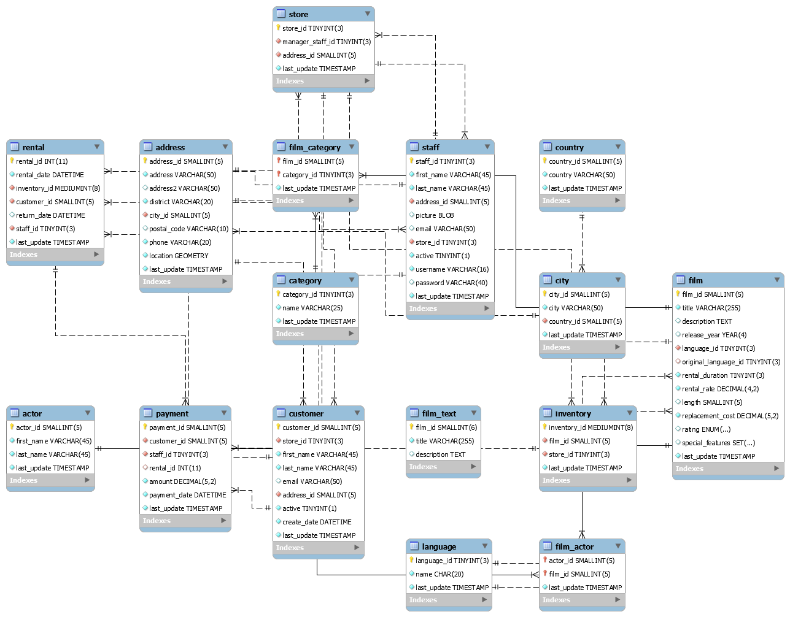

**Disclaimer:** This article is meant to enlighten. You are advised to research more on the subject matter. For further enquiries, send mail to eslintpurity@gmail.com or use the comment section below. <a href = "https://docs.google.com/forms/d/e/1FAIpQLSePs6HAZiFjcHBNhTN4lSXbQuylzx_cZPbftGQq0aoMLungTQ/viewform?usp=sf_link">Connect with me</a> for consultancy or freelancing jobs. 

<div class="alert alert-info" style="padding-top:2.2%; padding-bottom: 3%;margin-bottom: 1%;"><div class="row"><div class="col-lg-2"></div>
<div class="col-lg-10"><h4 style = "font-size: 29px;">Introduction to MariaDB Relational Database Management System</h4>
<span style = "font-size: 13.5px; padding-top:100px;">Series: Designing a Cinema Management System with MariaDB and PHP - PART 1</span><span style = "float:right;"> Author: <a href = "about.html"><span style = "color:#3e51ff;">Doyin-Elugbadebo</span><a><span></div></div>
</div>
<div class="row">
<div class="col-xl-12 mx-auto" style = "margin-right: 1.61%; margin-left: 1.61%;"><span style =  "color:#38c7d8; float: left">WRITTEN: 27th August, 2017&nbsp;</span> <span style =  "color:#f1f1f1;">///////////////////////////////////////-()-/////////////////////////////////////////</span><span style =  "color:#38c7d8; float: right;"> MODIFIED: 30th July, 2018</span>
</div>
</div>

<button class="accordion">Outline</button>
<div class="panel-accordion">

- Introduction</br>
- Requirement Analysis</br>
- Objectives</br>
- Installation</br>
  -- Requirements</br>
  -- Installing pip, virtualenv and virtualenvwrapper</br>
  -- Installing Flask</br>
  -- Launching Flask</br>
- Templating</br>
- Conclusion</br>
- Resources
</p>
</div>

</br>

<div style = "float: right;">[[Download full code]](http://www.github.com/eslintpurity/intro_to_rdbms_using_mysql_for_MARVINVIEW)</div>

## <span style = "color: purple;">Introduction</span>

***

<script async src="//pagead2.googlesyndication.com/pagead/js/adsbygoogle.js"></script>
<script>
  (adsbygoogle = window.adsbygoogle || []).push({
    google_ad_client: "ca-pub-4119834753934649",
    enable_page_level_ads: true
  });
</script>

<br>

<div class="text-center">


</div> 

<br>

Are you a web developer desiring to learn MySQL and MariaDB fast?

This is the first part in the tutorial series: **Designing a Cinema Management System with MariaDB and PHP.** Its a two-edged sword tutorial geared at a more friendly, easy-to-follow and practical approach in teaching MySQL and MariaDB, bridged for both beginners and advanced users. <span style = "color:#3e51ff;"> We’ll be designing, quering and administering a database system for Krystalview Galleria - A Fictitious Online Cinema Booking System.</span>

Dont be scared learning two RDBMS systems at a time, its the best route to learn MariaDB while notching and using tricks from MySQL. Couldn't be better. MariaDB is a open source database management system. Infact, it's a fork (copy of base source files) of MySQL with the main goals to be compatible with MySQL, but including **new features focused on performance**. So a better way to be proficient with MariaDB may be having a good understanding of MySQL. However, both are ridicously simple as you'll see in this tutorial. 

For brevity, we will refer to **MariaDB exclusively** throughout this series, but the concepts and comands outlined here apply to MySQL as well.


https://www.citypopulation.de/php/nigeria-admin.php?adm2id=NGA012018

***
<p style = "text-align:center; font-size: 18px; color:purple;">However, both are ridiculously simple as you'll see in this tutorial</p>

***

This series is modelled to be different from other tutorials as it facilitates gaining hands-on experience. We would incrementally build our system right from the scratch, nothing like sample data. Also, you wont be tied down to a single approach. For example, you have a liberal hand to use provided data, import your own or use a generator to populate your database. **Codes are also provided if you ever found yourself impatient typing out the scripts.**

The tutorial is designed to unfold in steps, one section leading to another. More importantly, this series was modelled so that you master how to use MariaDB effectively to get your work done more productively. <span style = "color:#3e51ff;"> If you go through the entire series, you will know how to manage MariaDB databases and manipulate data using various techniques such as SQL queries, stored procedures, transactions, database views, triggers, functions and of course the seanless integratiion with our PHP programming interface. 

We’ll round up the series briefly extending our database systems to other programming interfaces like Python and Node.js coupled with a brief intro to NoSQL using MongoDB. For the data scientist, we’ll connect our database design to R where different analytics would be performed. Also, The UX and Frontend Designers won’t be left out; as we would be creating our frontview using STACK of Laravel, Bulma and vue.jS. 

<span style = "color:#3e51ff;">Database Administrators, web developers, data scientists, programmers, GIS experts or hobbyist would benefit from this series.</span>

Lets get started...

<br>

***Note:** The full series syllabus is available [here](http://www.github.com/eslintpurity)*

<br>

### What is a Database?

***

Have you ever worked with tables using any word authoring tool like Microsoft Word or Open office. Any experience with spreadsheet package like excel of microclipse. Or you've used the cloud tool office suites before? Then you've related with a database. However, if you've had no experience with the above procedures. No Problemo. You'll pick it in 5minutes.

<div class = "alert alert-success">A database is simply container for storing and retrieving our data. It is made up of one or more tables with rows and columns.</div> 

For example, we may have inquired 5 students from a university for their basic information. This we then try to present in a tabular form below. The table below constitutes a database at the basic form. Remember a database is made up of one or more tables. Additionally, keep in mind that MariaDB uses the terms database and schema interchnageably.

ID    | Firstname  | Lastname | Mobile    | Movie            | Booking Date | Show Date
----- | ------     | -------  | --------- | ---------------  | ---------    | ----------
CIN00001 | Doyin   | Elugbadebo | 08084564378 | The Adventure of Ikadra | 27-May-2009 | 5th June 2010
CIN00002 | Thelma  | Morgan | 08084563435 | rise and fall of Idiama |27-Sept-2011 | 9th Oct 2011
CIN00003 | Sinatra | Centurion | 08084563772 | Lets Reconnect | 27-Nov-2018 | 29th Nov 2018
   .     |    .    |     .      |      .      |            .            |      .      |       . 
   .     |    .    |     .      |      .      |            .            |      .      |       .
   .     |    .    |     .      |      .      |            .            |      .      |       . 
CIN00020 | Sandra  | James | 08084563778 | When Next we meet | 26-June-2019 | 29th June 2019

Database when grown, may tend cumbersome to manage, hence we need a concept that could relate the information in such table without repetition, hence the name relational database. <span style = "color: red;">Remember; coherence is the order of the day.</span> Companys have gone to create hosts of database package from Oracle, MySQL, PostgreSQL, SQL Lite and Microsoft SQL Server e.t.c. 

We'll be learning using MySQL and MariaDB.

<blockquote>With well over 10 million installations, MySQL is probably the most popular database management system for web servers. MariaDB on the other hand is an improved version of MySQL focused more on performance. Both are highly scalable and most importantly integrates seamlessly with PHP</blockquote>

**A quick important question we need to ask ourselves is how do we interact with our database at the basic level?**. 

To persist or query our database, we need a Data Manipulation Language (DML) along with it routines and operations. A widely accepted one is known as SQL, which stands for Structured Query Language. This language is loosely based on English and also used in other databases such as Oracle and Microsoft SQL Server. It is designed to allow simple requests from a database via commands such as: SELECT, GRANT and CREATE. 

A simple example is illustrated below

```{r, eval = FALSE}
SELECT * FROM customer WHERE customerFirstName = 'Doyin';
```
Explaining this in English means **"select all fields from the customer table having Doyin as firstname"** or **"if Doyin is customer's first name, then select all fields from customer table."**. Don't worry, all these would be blown open as we progress in the tutorial. 

Without further ado, lets dig into our Cinema Database System.

<br>

<div class="text-center">


</div> 

<br>

#### Krystalview Requirement Analysis

***

This is 21st century!. A good software must be designed to stand the test of time. How do you do these, you need a clear and concise blue print - these may be in terms of logistics, modelling, wireframing or simple mockups.

If you intend taking your database design skills further or already a database administrator, there are easy to use tools for planning out your design. [Microsoft Visio](http://www.visio.com) or [MySQL Workbench](http://www.mysqlworkbench.com) are good dektop tools. Web applications such as [Lowdown](http://www.lowdown.com) and [Balsamiq Mockups](http://www.balsamiq.com) are good alternatives. For overall project management of your database consulting jobs, [Mindview](http://www.mindview.com) may help streamline your planning and execution process.

Ok! enough of planning skills.

The business model of movie ticket booking portals is quite simply. They help people book movie tickets online, and for every ticket booking, the website charges money. Such platforms also share all the details about the films along with reviews, storyline, cast, and other critical details. To understand the more about the concept, you can interact with online cinemas such as [Silverbird Galleria](http://www.silverbirdcinema.com), [Big Cinemas](http://www.bigcinema.com) or [Bookmyshow](http://www.book,myshow.com).

<div class = "alert alert-info">As recently as 2003, IBM stated, “Most software projects fail. In fact, the Standish group reports that over 80% of projects are unsuccessful either because they are over budget, late, missing function, or a combination. Moreover, 30% of software projects are so poorly executed that they are canceled before completion.”</div>

Ok. The name of our Cinema is Krystalview Galleria. We have three different branches with a central Database Syetms. Priviledges are ranted based on the level of our staffs. In all, there are 12 different personnel who can interact and manage the database comprising of four from each branch. A central Administrator distributes and grant perimissions to these people, thus making it the invible 13th man. In regards to all these customers can login in to a porter, create a profile, book for a movie, cancel movie or reschedule a movie, tracks are also kept on deleted movies. Some stored in memory and dumped off after expiration of cookies e.t.c 

Good, I believe you have a general idea of what our database should look like. This may range from creating clients page, staffs page, movies page, branch page. All these constitutes tables at their own right. You may have started thinking, how do we relate all these information together? and you wouldn't be judged for your thoughtS. Ok. What if we try create unique identifying for each table? would that solve the problem? We will see as we move on.

***

<p style = "text-align:center; font-size: 18px; color:purple;">Remember; coherence is the order of the day</p>

***

All these and more thoughts will lead to creating diffrent tables. But how would you cope as a beginner if everything is jammed packed? Its bad right? So we will start with the basic tables and increment as we progress. Our basic basic is presented below. However, if you more proficient as an  administrator or inquistitive on the overall structure of our design. Then, the full model is available here. Please keep in mind there may be slight adjustment or alterations as we progress.



Tables 1 (`registration` table) and Table 2 (`customers` table) shows the first needed tables in our work. More would be added as we progress

**Table 1:** Krystalview Registration Table 

ID    | Firstname  | Lastname | Mobile    | Movie            | Booking Date | Show Date
----- | ------     | -------  | --------- | ---------------  | ---------    | ----------
CIN00001 | Doyin   | Elugbadebo | 08084564378 | The Adventure of Ikadra | 27-May-2009 | 5th June 2010
CIN00002 | Thelma  | Morgan | 08084563435 | rise and fall of Idiama |27-Sept-2011 | 9th Oct 2011
CIN00003 | Sinatra | Centurion | 08084563772 | Lets Reconnect | 27-Nov-2018 | 29th Nov 2018
   .     |    .    |     .      |      .      |            .            |      .      |       . 
   .     |    .    |     .      |      .      |            .            |      .      |       .
   .     |    .    |     .      |      .      |            .            |      .      |       . 
CIN00020 | Sandra  | James | 08084563778 | When Next we meet | 26-June-2019 | 29th June 2019

<br>

**Table 2:** Krystalview Customer Table 

ID    | Firstname  | Lastname | Mobile    | Movie            | Booking Date | Show Date
----- | ------     | -------  | --------- | ---------------  | ---------    | ----------
CIN00001 | Doyin   | Elugbadebo | 08084564378 | The Adventure of Ikadra | 27-May-2009 | 5th June 2010
CIN00002 | Thelma  | Morgan | 08084563435 | rise and fall of Idiama |27-Sept-2011 | 9th Oct 2011
CIN00003 | Sinatra | Centurion | 08084563772 | Lets Reconnect | 27-Nov-2018 | 29th Nov 2018
CIN00020 | Sandra  | James | 08084563778 | When Next we meet | 26-June-2019 | 29th June 2019


Now that some of the concepts are becoming clearly. Lets analysis the lesson objectives

<br>

### Lesson Objective:

***

Are you knot? why learning objectives now? Well, we may both be knots.

Dont sweat over it - was a joke.

If you've read so far and still intend continuing, then the strateging of teaching in the 21st century is working. Infact, you may decide to come up with a plan as far as it conforms a bit to traditions but more to dissemination. Ok? And you'll be happy we are almost done. The truth is the part emphaisez and says a lot about words. Its very important, if you could understand the concepts well at this level. then our communication would be much more straight easire and straight forwards.s We would'nt say much.

**We aren't talkative! Developers are not talkative!! **

Ok enough of we aren't talkatives. The objectives please.

By the end of this lesson you will be able 

- to install a database system on your computer, create a database table, store information in the table and then query the data. At the conclusion of the lesson we’ll use a query of the database to make a graph.
- install a database system on your computer, create a database table, store information in the table and then query the data. At the conclusion of the lesson we’ll use a query of the database to make a graph.

<br>

### Installing a Database System

To be a proficient Database Administrator, you need to master using the Command prompt.  You need lots of interactions with the CLI, thus you will need to know how to use it. For the beginners, a command line promt is a window that allows you write you code from a terminal rather from a GUI like XAMPP. One good one comes installed with XAMPP. Its basic and not intuitive,  though its powrefuul and would love the ssame thing expensives one. But getting a fancy commad line prompt would surely enhace your productivity. A good one I found is called MySQL shell. Visit here to download it. 


### Summary of Database Terms

***

A MySQL database contains one or more tables, each of which contains records or rows. Within these rows are various columns or fields that contain the data itself. Table 8-1 shows the contents of an example database of five publications detailing the author, title, type, and year of publication.

Each row in the table is the same as a row in a MySQL table, and each element within a row is the same as a MySQL field.


Term | Description
-------- | --------------------------------------
Database | The overall container for a collection of MySQL data
Table | A subcontainer within a database that stores the actual data
Row | A single record within a table, which may contain several fields. It is also known as a tuple, entry, or record.
Column | The name of a field within a row
Redundancy | The term redundancy specifies how to store data twice in order to accelerate the system.
Primary Key | Primary key is a unique identifying value. This value cannot appear twice within a table, and there is only one row associated with it.
Foreign Key | A foreign key is used as a a link between two tables.
Compound Key | A compound key, or composite key, is a key that refers to multiple columns. It refers to multiple columns due to a column lacking a unique quality.
Index | An index is virtually identical to the index of a book.
Referential Integrity | This term refers to ensuring all foreign key values point to existing rows.


<br>

<div class="text-center">


</div> 

<br>

### Interacting with MySQL Database

***

There are three main ways in which you can interact with MySQL: using a command line, via a web interface such as phpMyAdmin, and through a programming language like PHP, Node.js and python. We'll use the first two in the few series before we move to the last one.

### Accessing MySQL via the Command Line

***

By default, the initial MySQL user will be root and will not have had a password set. Seeing as this is a development server that only you should be able to access, we won’t worry about creating one yet. So, to enter MySQL’s command-line interface, select Start→Run, enter CMD into the Run box, and press Return. This will call up a Windows Command Prompt. From there, enter one of the following (making any appropriate changes as just discussed):

This command tells MySQL to log you in as user root, without a password. You will now be logged into MySQL and can start entering commands. So, to be sure everything is working as it should be, enter the following (the results should look similar to the output shown in Figure 8-1):

```{r, eval = FALSE}
SHOW databases;
```

A Developer that doesn't know how to interact with or manage a database. Is that one a developer? Dont loss your hair, its not personal, rather a joke. I developed an article that leverages the power of PHP with MariaDB Database for Web Developers, GIS Analyst, Database Administrator or even hobbyist. [Check it out]() you may learn one or two things.

Note, you may not be oprating on you local system and you still want to have access to you dtabase, then you the following syntax. The words in bracket are to be replacedite word.  with appropriate words. 

```{r, eval = FALSE}
mysql -u [username] -p -h[@ip_address or hostname] [database_name]
```
 
For example if am operating remotely with an ip addresss 127.89.088, username KrystalviewManager, then I'll launch the following command. the system will return with a carriage return requesting for password, which must be entered appropariately.

```{r, eval = FALSE}
mysql -u KrystalviewManager -p -h @127.036738.037 KrystalviewDB
```

The semicolon

Let’s start with the basics. Did you notice the semicolon (;) at the end of the SHOW databases; command that you typed? The semicolon is used by MySQL to separate or end commands. If you forget to enter it, MySQL will issue a prompt and wait for you to do so. The required semicolon was made part of the syntax to let you enter multipleline commands, which can be convenient because some commands get quite long. It also allows you to issue more than one command at a time by placing a semicolon after each one. The interpreter gets them all in a batch when you press the Enter (or Return) key and executes them in order.

## MySQL Commands

You’ve already seen the SHOW command, which lists tables, databases, and many other items. The commands you’ll probably use most often are listed in Table 8-3. 

*Table: A selection of common MySQL commands*

Command  | Action           
-------- | ------------------ 
ALTER | Alter a database or table
CREATE | Create a database
DELETE | Delete a row from a table
DESCRIBE | Describe a table’s columns
DROP | Delete a database or table
EXIT | (CTRL-C) Exit
GRANT | Change user privileges
HELP | (\h, \?) Display help
INSERT | Insert data
RENAME | Rename a table
SHOW | List details about an object
TRUNCATE | Empty a table
UPDATE | Update an existing record
USE | Use a database


Other less used commands 

LOCK/UNLOCK: Lock and unlock table(s)
QUIT: (\q) Same as EXIT
BACKUP: Backup a table
SOURCE: Execute a file
STATUS: (\s) Display the current status
[cinema_table_intro.md](www/github/eslintpurity/intro_to_rdbms_using_mysql_for_MARVINVIEW/cinema_table_intro.md)

GRANT ALL ON publications.* TO 'jim'@'localhost' IDENTIFIED BY 'mypasswd';

What this does is allow the user jim@localhost full access to the publications database using the password mypasswd. You can test whether this step has worked by entering quit to exit and then rerunning MySQL the way you did before, but instead of entering\

```{r, eval = FALSE}
-u root -p, type -u jim -p, or whatever username you created.
```

### Accessing MySQL using phpMyAdmin

At this point, you should now be logged into MySQL with ALL privileges granted for the database publications, so you’re ready to create your first table. Make sure the correct database is in use by typing the following:

```{r, eval = FALSE}
USE publications;
```

Now enter the commands in Example 8-3 one line at a time.

```{r, eval = FALSE}
CREATE TABLE classics (
author VARCHAR(128),
title VARCHAR(128),
type VARCHAR(16),
year CHAR(4)) ENGINE MyISAM;
```

MySQL should then issue the response Query OK, 0 rows affected, along with how long it took to execute the command. You see an error message instead, check your syntax carefully. Every parenthesis and comma counts, and typing errors are easy to make. In case you are wondering, the ENGINE MyISAM tells MySQL the type of database engine to use for this table. 

To check whether your new table has been created, type:

```{r, eval = FALSE}
DESCRIBE classics;
```

All being well, you will see the sequence of commands and responses shown in Example 8-4, where you should particularly note the table format displayed. 

```{r, eval = FALSE}
mysql> USE publications;
Database changed
mysql> CREATE TABLE classics (
-> author VARCHAR(128),
-> title VARCHAR(128),
-> type VARCHAR(16),
-> year CHAR(4)) ENGINE MyISAM;
Query OK, 0 rows affected (0.03 sec)
mysql> DESCRIBE classics;
```


```{r, eval = FALSE}
+------------------+----------------+-------+------+----------+--------+
| Field            | Type           | Null  | Key  | Default  | Extra  |
+------------------+----------------+-------+------+----------+--------+
| booking_id       | varchar(128)   | YES   |      | NULL     |        |
| username         | varchar(128)   | YES   |      | NULL     |        |
| firstname        | varchar(128)   | YES   |      | NULL     |        |
| lastname         | varchar(128)   | YES   |      | NULL     |        |
| mobile           | char(4)        | YES   |      | NULL     |        |  
| movie            | varchar(16)    | YES   |      | NULL     |        |
| booking_date     | char(4)        | YES   |      | NULL     |        |
| show_date        | timestamp(2)   | YES   |      | NULL     |        |
+------------------+----------------+-------+------+----------+--------+
4 rows in set (0.00 sec)
```

### Creating table using phpMyAdmin

Field : The name of each field or column within a table.
Type: The type of data being stored in the field.
Null: Whether a field is allowed to contain a value of NULL.
Key: MySQL supports keys or indexes, which are quick ways to look up and search for
data. The Key heading shows what type of key (if any) has been applied.
Default: The default value that will be assigned to the field if no value is specified when a
new row is created.
Extra: Additional information, such as whether a field is set to auto-increment.


```{r, eval = FALSE}
read.table("C://Projects/Generators/Rmarkdown/eslintpurity/cinema.txt", header = TRUE, stringsAsFactors = FALSE, sep = ",")
```

INSERT INTO [What is the name of our database?]

Follow this syntax: 

```{r, eval = FALSE}
INSERT INTO {{database_name}}({{database_fields}}) VALUES({{enclosed_comma_seperated_field_values}})
```

Hence, we have 

```{r, eval = FALSE}
INSERT INTO marvinview(booking_id, firstname, lastname, mobile, movie, booking_date, show_date) 
  VALUES(CIN001, "Doyin", "Williams", 08084564378, "The Adventure of Ikad", 27-May-2009, 5th June 2010),
    
INSERT INTO marvinview(booking_id, firstname, lastname, mobile, movie, booking_date, show_date) 
  VALUES(CIN002, "Thelma", "Morgan", 08084563435, "The rise and fall of Ika", 27-Sept-2011, 9th Oct, 2011)
    
INSERT INTO marvinview(booking_id, firstname, lastname, mobile, movie, booking_date, show_date) 
  VALUES(CIN003, "Sinatra", "Centurion", 08084563772, "Lets Reconnect", 27-Nov-2018, 29th Nov, 2018),
    
INSERT INTO marvinview(booking_id, firstname, lastname, mobile, movie, booking_date, show_date) 
  VALUES(CIN004, "Adekunle", "Wale", 08084563524, "Again in the Lord's Te", 27-April-2017, 29th June, 2018)
    
INSERT INTO marvinview(booking_id, firstname, lastname, mobile, movie, booking_date, show_date)
  VALUES(CIN004, "Adekunle", "Wale", 08084563778, "Again in the Lord's Te", 27-April-2017, 29th June, 2018)
```


SELECT * FROM cinema WHERE firstname = Doyin & lastname = Morgan;

```{r, eval = FALSE}
+------------+-----------+------------+-------------+---------------------+--------------+------------+
| booking_id | firstname | lastname   | mobile      | movie               | booking_date | show_date  | 
+------------+-----------+------------+-------------+---------------------+--------------+------------+
| CIN00001   | Doyin     | Elugbadebo | 08084564378 | The Adventure of Ik | 27-08-2009   | 27-05-2009 |       
| CIN00002   | Thelma    | Morgan     | 08084563435 | The rise and fall o | 27-05-2009   | 27-03-2009 |       
| CIN00003   | Sinatra   | Centurion  | 08084563772 | Lets Reconnect      | 27-03-2009   | 27-08-2009 |       
| CIN00004   | Adekunle  | Wale       | 08084563524 | Again in the Lords  | 27-01-2009   | 27-09-2009 |       
| CIN00005   | Adekunle  | Siro       | 08084563778 | Again in the Lords  | 27-04-2009   | 27-03-2009 |      
+------------+-----------+------------+-------------+---------------------+--------------+------------+
4 rows in set (0.00 sec)
```


```{r, eval = FALSE}
INSERT INTO marvinview(booking_id, firstname, lastname, mobile, email, movie, booking_date, show_date) VALUES(X)

X = (CIN001, "Doyin", "Williams", 08084185154, "doyinelugbadebo@gmail.com", The Adventure of Ikadra", 27-May-2009, 5th June 2010),
    (CIN002, "Thelma", "Morgan", 07054673835, "mudiaga@yahoo.com", "The rise and fall of Idiama", 27-Sept-2011, 9th Oct, 2011),
    (CIN003, "Sinatra Centurion", 0903458512, "olumidet1@gmail.com", "Lets Reconnect", 27-Nov-2018, 29th Nov, 2018),
    (CIN004, "Adekunle Wale", 08084185154, "lekanelugbadebo@gmail.com", "Again in the Lord's Temple", 27-April-2017, 29th June, 2018)
    (CIN005, "Adekunle Wale 2", 08084185154, "doyinelugbadebo@gmail.com", "Again in the Lord's Temple", 27-April-2017, 29th June, 2018)
```


<br>

### Conclusion

***

In this chapter, we learned how to use partitioning to optimize very big tables. We learned which partitioning types are supported by MariaDB and how to write a good partitioning expression. We examined a sample table and learned how we can benefit from different partitioning strategies. We discussed subpartitioning. We learned the SQL statements that can be used to maintain partitions. Finally, we discussed how the optimizer excludes the irrelevant partitions from a statement execution, and how the use can force the exclusive use of some partitions.In the next chapter, we will discuss how to distribute data across multiple servers.

<br>

<div class ="container-fluid">
<div class = "row">
<div class="col-lg-6 col-md-6">
<a href = "database.html"><button class="btn btn-default btn-block" style = "float:left;"><span style = "float:left; color: white;"><<- Previous </span></button></a>
</div>

<div class="col-lg-6 col-md-6">
<a href = "database.html"><button class="btn btn-default btn-block"><span style = "float:right; color: white;">Next  ->></span></button></a>
</div>
</div>
</div>

</br>

***

<div class = "alert alert-info">
<div class="row">
<div class="col-lg-2 col-md-2">

</div>

<div class="col-lg-10 col-md-10">
<p style = "font-size: 19px;">About the Author<span style = "float:right; font-size: 12.5px; color: red;padding-left: -12%;">Hire</span></p>
<span><span style ="color: grey;">DOYIN ELUGBADEBO:</span> Doyin is a Freelancer, Software Developer and Deep Learning Practitioner <a href = "http://www.krystalnet.com">@Krystalnet Solutions Inc.</a>. He has served in various capacities either as a consultant, developer or a machine learning expert. <span style = "color: purple;">A lover of nature and an ICT fanatics who hope sticking around witnessing what transpires between human and machines when the latter develops true intelligence.</span></span> 

Reach him via: <span style = "color: purple; font-size:10px;">Email: </span>eslintpurity@gmail.com --|-- <span style = "color: purple; font-size:10px;">Whatzapp: </span> 08084185154 --|-- <span style = "color: purple; font-size:10px;"> Web:</span>  [doyinelugbadebo.com](https://doyinelugbadebo.com)
<br>
<span class="label label-primary"><a href = "http://www.linkedin/elugbadebo-doyin/" style = "color: white;">LinkedIn</a></span>
<span class="label label-success" style = "color: white;"><a href = "http://www.twitter.com/eslintpurity/" style = "color: white;">Twitter</a></span>
<span class="label label-info" style = "color: white;"><a href = "http://www.pantheon/elugbadebo-doyin/" style = "color: white;">Pantheon</a></span>
<span class="label label-warning" style = "color: white;"><a href = "http://www.github.com/eslintpurity/" style = "color: white;">Github</a></span>
</div>
</div>
</div>

<!--Beginning Disqus-->

<div id="disqus_thread"></div>
<script>

/**
*  RECOMMENDED CONFIGURATION VARIABLES: EDIT AND UNCOMMENT THE SECTION BELOW TO INSERT DYNAMIC VALUES FROM YOUR PLATFORM OR CMS.
*  LEARN WHY DEFINING THESE VARIABLES IS IMPORTANT: https://disqus.com/admin/universalcode/#configuration-variables*/
/*
var disqus_config = function () {
this.page.url = PAGE_URL;  // Replace PAGE_URL with your page's canonical URL variable
this.page.identifier = PAGE_IDENTIFIER; // Replace PAGE_IDENTIFIER with your page's unique identifier variable
};
*/
(function() { // DON'T EDIT BELOW THIS LINE
var d = document, s = d.createElement('script');
s.src = 'https://eslintpurity.disqus.com/embed.js';
s.setAttribute('data-timestamp', +new Date());
(d.head || d.body).appendChild(s);
})();
</script>
<noscript>Please enable JavaScript to view the <a href="https://disqus.com/?ref_noscript">comments powered by Disqus.</a></noscript>

<!--End Disqus-->