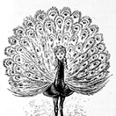

---
output:
  html_document:
    theme: united
---

<header class="masthead text-white text-center">

<h2 class="w3-wide" style ="color:teal; font-size: 50px;">Flutter Tutorials</h2>
<h4 class="w3-opacity" style ="font-size: 15px; color:red;">Carefully crafted for you</h4>

<h4 class="w3-opacity" style ="font-size: 10px; color:teal;">Author: DOYIN-ELU</h4>

<h4 class="w3-opacity" style ="font-size: 10px; color:teal;">Editor: AMANDA VISCOTTI</h4>

<h4 class="w3-opacity" style ="font-size: 10px; color:teal;">Credits: DOYIN-ELU</h4>

<header>

       ////////////////////////////////////////////////////////////////////////////////////////////////////////////////////////////////////////////////////////////////////////////////

<a href = "javascript.html"><button class="btn btn-default btn-block" style = "float:left;"><<- Previous Module</button></a>

<a href = "laravel.html"><button class="btn btn-default btn-block">Next Module ->></button></a>

***

 

 

DOYIN ELUGBADEBO

Make an Instangram Like Site with Ruby on Rails

Lorem ipsum dolor sit amet, consectetur adipiscing elit. Sed at ante. Mauris eleifend, quam a vulputate dictum, massa quam dapibus leo, eget vulputate orci purus ut lorem. In fringilla mi in ligula. Pellentesque aliquam quam vel dolor. 

