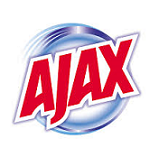
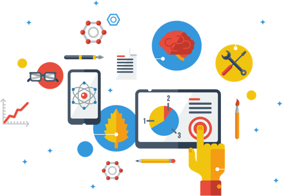

<div class="container-fluid" style = "background-image: linear-gradient(to bottom right,#fe2f3 0,#fef485 100%); background-repeat: no-repeat; background-attachment: fixed; background-size: cover; background-color:  #85929E; margin-right: -24%; margin-left: -24%; padding-right: 24%; padding-left: 24%; padding-bottom: 4%;">
<div class = "row"> 
<span class="label label-default">JavaScript</span>
<span class="label label-success">Laravel</span>
<span class="label label-danger">Clojure</span>
<span class="label label-info">Versioning</span>
<span class="label label-warning">R and Python ML</span>
<span class="label label-primary">Ruby on Rails</span>
<span class="label label-default">Angular</span>
<span class="label label-success">Wordpress</span>
<span class="label label-info">GIS</span>
<span class="label label-warning">Biz Analytics</span>
<span class="label label-default">Data Mining</span>
<span class="label label-success">React</span>
<span class="label label-info">Deep Learning</span>
<span class="label label-info">Golang</span>
<span class="label label-default">QGIS</span>
<span class="label label-primary">Tensorflow</span>
<span class="label label-success">Flask</span>
<span class="label label-danger">JQuery</span>
<span class="label label-info">Meteor</span>
<span class="label label-default">Spatial Analysis</span>
<span class="label label-warning">Node.js</span>
<span class="label label-info">TypeScript</span>
<span class="label label-default">Docker</span>
<span class="label label-primary">DevOps</span>
<span class="label label-danger">PrismicJS</span>
<span class="label label-warning">ArcGIS</span>
<span class="label label-info">Spark</span>
<span style = "color: red;"> ><span style = "color: black;">></span>> </span> <span> <a href = "https://docs.google.com/forms/d/e/1FAIpQLSePs6HAZiFjcHBNhTN4lSXbQuylzx_cZPbftGQq0aoMLungTQ/viewform?usp=sf_link" style = "color: white; font-size: 10px;">[GET-IN-TOUCH]</a></span>
</div>

<a href ="https://docs.google.com/forms/d/e/1FAIpQLSePs6HAZiFjcHBNhTN4lSXbQuylzx_cZPbftGQq0aoMLungTQ/viewform?usp=sf_link">
</a>

<a href ="https://docs.google.com/forms/d/e/1FAIpQLSePs6HAZiFjcHBNhTN4lSXbQuylzx_cZPbftGQq0aoMLungTQ/viewform?usp=sf_link"><h1 style="font-size: 94px; font-weight: lighter; color: #f1f1f1; line-height: 90px;">Doyin</h1></a>
<a href ="https://docs.google.com/forms/d/e/1FAIpQLSePs6HAZiFjcHBNhTN4lSXbQuylzx_cZPbftGQq0aoMLungTQ/viewform?usp=sf_link"><h1 style="font-size: 94px; font-weight: lighter; color: #f1f1f1; word-wrap:break-word;">Elugbadebo</h1></a>
<h5 style = "color: #ccc; font-size: 15px;">Software Developer | Deep Learning Practitioner | Technical Writer | Author</h5>

</div>

<hr class = "light">

<h6><b>Note:</b> This site is currently under development and testing stage. There are broken links with incomplete pages. Plz navigate with care. Kindly check back for the revamped version.</h6>

<div><h4 class = "text-center" style = "font-size: 16px; color: purple;">Please dont hesitate to <a href = "https://docs.google.com/forms/d/e/1FAIpQLSePs6HAZiFjcHBNhTN4lSXbQuylzx_cZPbftGQq0aoMLungTQ/viewform?usp=sf_link"><button class="w3-button w3-black w3-margin-bottom" style = "margin-top: 1.3%;">Hire Me</button></a> for your next project...<span onclick="document.getElementById('hireModal').style.display='block'" style = "color: blue; float: right; margin-top: 2%;">why hire me?</a></span></h4></div>

This site showcases my [expertise](about.html), [tutorials](tutorial.html), [past and current projects](project.html), [my books](books.html), links to <span><a href = "#" data-toggle="modal" data-target="#commservModal">External Projects</a></span> and third party resources. 

Feel free to <a href = "https://docs.google.com/forms/d/e/1FAIpQLSePs6HAZiFjcHBNhTN4lSXbQuylzx_cZPbftGQq0aoMLungTQ/viewform?usp=sf_link">hire me</a> if you need a **Consultant or Freelancer** for your `App Development and Business Intelligence Solutions`. I posses the requisite background in various internet technologies and predictive analytics. Some of my core expertise include UI and UX Design, Big Data Analytics, Web-scraping, MVC Engineering, Virtualization, RESTful APIs Programming & Consumption, Security Engineering, Simulation, Database Management, R and Python Machine Learning, Cloud Deployment, Accessibility, Material Design Implementation and Versioning. My expertise extends also to Geographic Information Systems and <a href="http://microclipse.com/" target="_blank">Data Mining</a> related solutions. Visit <a href = "#dropdown1-tab" data-toggle="tab">Here</a> for some of my web and mobile-apps projects and <a href="#dropdown2" data-toggle="tab">Here</a> for my Interactive Analytics App written in both `python` and `R-statistical`.

**I work with diligence and alacrity with strong focus on clean service delivery; while balancing speed with quality.** Be free to view [my CV](files\doyin_elugbadebo.pdf) and [my resume](files//resume_doyin_elugbadebo.pdf) for your perusal.

<p style = "colgior: purple;">Please use the guide below for easy navigation; and I do hope you find the resources on this site useful.</p>

Thanks!. Looking forward to meeting you.

</br>

<div class="container-fluid">
<div class = "row">
<div class = "text-center col-lg-3 col-md-3 mx-auto">
<h4 class="text-center" style = "text-decoration-color: purple;"><a href = http//www.krystallux.com>Projects</a></h4>
[](http://microclipse.com)
</div>

<div class = "text-center col-lg-3 col-md-3 mx-auto">
<h4  class = "text-center" style = "color: purple;"><a href = "#" data-toggle="modal" data-target="#commservModal">Community Services</a></h4>
<a href = "#" data-toggle="modal" data-target="#commservModal"></a>
</div>

<div class = "text-center col-lg-3 col-md-3 mx-auto">
<h4 class="text-center" style = "color: purple;"><a href = "about.html">Contact</a></h4>
[](about.html)
</div>

<div class = "text-center col-lg-3 col-md-3 mx-auto">
<!-- Trigger FAQ modal with a button or a link  -->
<h4 class = "text-center" style = "color: purple;"><a href = "#" data-toggle="modal" data-target="#faqModal">FAQ</a></h4>
<a href = "#" data-toggle="modal" data-target="#faqModal"></a>
</div>
</div>
</div>

<h4 style = "line-height: 25px;">Currently on the blueprint of some apps I planned opensourcing. Suggestions and contributions are welcomed. Please visit [here](http://www.github.com/eslintpurity) for more info.</h4>

Also, you can follow this link => http://doyinelugbadebo.com/archive/a-guide-on-how-i-built-my-website-using-rmarkdown/ to learn how I built this website.

<br><br>

<section>
<div class="container-fluid" style= "background-image: linear-gradient(0deg, #ECE0C8 49%, #DCE0E1 77%); background-repeat: no-repeat; background-attachment: fixed; background-size: cover; margin-right: -25%; margin-left: -25%; padding-bottom: 7%; padding-top: 10%;">
<div class="container">
<div class = "row">
<div class = "col-md-5">

### Train your Model with Beautiful Plots

```{r, eval=FALSE}
library(htmlwidgets)
library(widgetframe)
library(ggplot2)
library(plotly)
p <- ggplot(data = diamonds, aes(x = cut, fill = clarity)) + geom_bar(position = "dodge")
ggplotly(p)
```

</div>

<div class = "col-md-7">
<div id="myCarousel" class="carousel slide" data-ride="carousel">
<!-- Indicators -->
<ol class="carousel-indicators">
<li data-target="#myCarousel" data-slide-to="0" class="active"></li>
<li data-target="#myCarousel" data-slide-to="1"></li>
<li data-target="#myCarousel" data-slide-to="2"></li>
</ol>
<!-- Wrapper for slides -->

<div class="carousel-inner" role="listbox">
<div class="item active">

```{r echo=FALSE, message=FALSE, warning=FALSE}
library(htmlwidgets)
library(widgetframe)
library(ggplot2)
library(plotly)
p <- ggplot(data = diamonds, aes(x = cut, fill = clarity)) + geom_bar(position = "dodge")
ggplotly(p)
```

</div>
<div class="item">

```{r echo=FALSE,  message=FALSE, warning=FALSE}
library(htmlwidgets)
library(widgetframe)
library(ggplot2)
library(plotly)
p <- ggplot(data = diamonds, aes(x = cut, fill = clarity)) + geom_bar(position = "dodge")
ggplotly(p)
```

</div>
<div class="item">

```{r, eval=FALSE}
library(magrittr)
library(highcharter)
library(widgetframe)
highchart() %>% hc_title(text = "Scatter chart with size and color") %>% hc_add_series(mtcars$wt, mtcars$mpg, mtcars$drat, mtcars$hp)
```

</div>
</div>
<!-- Left and right controls -->
<a class="left carousel-control" href="#myCarousel" role="button" data-slide="prev">
<span class="glyphicon glyphicon-chevron-left" aria-hidden="true"></span>
<span class="sr-only">Previous</span>
</a>
<a class="right carousel-control" href="#myCarousel" role="button" data-slide="next">
<span class="glyphicon glyphicon-chevron-right" aria-hidden="true"></span>
<span class="sr-only">Next</span>
</a>
</div>
</div>  <!--col-7-->
</div>  <!--row-->
</div>  <!--container-->

</section>

<section>
<div class="container-fluid" style = "background-attachment: fixed; background-size: cover; margin-right: -25%; margin-left: -25%; padding-bottom: 6%; padding-top: 7%;">
<div class="container" style = "padding-right: 12.65%; margin-left: 14.6%;">
<div class = "row">
<div class="col-lg-2 col-md-2">


</div>
<div class="col-lg-10 col-md-10" style ="margin-top=180px;">
<h3 style = "margin-top: 65px;font-size: 20px; color: purple;">...Oh!, I have got the priviledge working for some amazing brands...</h3>
</div>
</div>
<div class = "row">
<div class="col-lg-12 col-md-12"><marquee>&nbsp;&nbsp;&nbsp;&nbsp;&nbsp;&nbsp;&nbsp;&nbsp;&nbsp;&nbsp;&nbsp;&nbsp;&nbsp;&nbsp;&nbsp;&nbsp;&nbsp;&nbsp;&nbsp;&nbsp;</marquee>
</div>
</div>
<div class = "row"  style="margin-top: 10px;>
<div class="col-lg-12 col-md-12">
<h3 style = "font-size: 20px; color: purple;">....and you could be one of them!!!</h3>
</div>
</div>

</div>
</div>
</section>

<section>
<hr class"light">

<div class = "row"  style="margin-top: 25px;">
<div class="alert alert-info" style="padding-top: 3%;>

<h4 class = "text-center" style = "font-size: 16px; color: purple;">Please dont hesitate to <a href = "https://docs.google.com/forms/d/e/1FAIpQLSePs6HAZiFjcHBNhTN4lSXbQuylzx_cZPbftGQq0aoMLungTQ/viewform?usp=sf_link"><button class="w3-button w3-black w3-margin-bottom" style = "margin-top: 1.3%;">Hire Me</button></a> for your next project...</h4>

</div>
</div>
</section>
<section>
<div class="container-fluid" style= "background-image: url('images/Lighthouse.jpg'); background-repeat: no-repeat; background-attachment: fixed; background-size: cover; background-color: #ddd; margin-right: -24%; margin-left: -24%; padding-right: 24%; padding-left: 24%; padding-top: 6%; padding-bottom: 7%;">
<div class="row">
<div class = "col-lg-6 col-md-6">


</div>
<div class = "col-lg-6 col-md-6">
<h1 style="color: #0d0d0d;line-height: 45.5px;">Re-Engineering the Future</h1>
<h4 style="color: #194560;line-height: 22.5px;">With technology; *we hold the long-aged mantle to change the course of our events.* **Machine Learning, MVC Engineering, Telemedicine, Web 2.0** and **Artificial Intelligence** are all we got to redirect our future for the better. Be Part!!!</h4>
</br>
 
<!-- Begin Mailchimp Signup Form -->

<div id="mc_embed_signup">
<form action="https://gmail.us20.list-manage.com/subscribe/post?u=e2845c6383ec09508617199e4&amp;id=99033aaa06" method="post" id="mc-embedded-subscribe-form" name="mc-embedded-subscribe-form" class="validate" target="_blank" novalidate>
<div id="mc_embed_signup_scroll">
	
<input type="email" value="" name="EMAIL" class="email" id="mce-EMAIL" placeholder="email address" required>
<!-- real people should not fill this in and expect good things - do not remove this or risk form bot signups-->
<div style="position: absolute; left: -5000px;" aria-hidden="true"><input type="text" name="b_e2845c6383ec09508617199e4_99033aaa06" tabindex="-1" value=""></div>
<div class="clear"><input type="submit" value="Subscribe" name="subscribe" id="mc-embedded-subscribe" class="button"></div>
</div>
</form>
</div>

<!--End mc_embed_signup-->

</div>
</div>
</div>
</section>

</br>
<p style = "color: red;">If you ever found yourself in a maze, remember this...!</p>
<div class="w3-blue-grey">
<div class ="alert alert-info" style = "padding-top: 3%; padding-bottom: 3%; color:#778899;"><h2 class="w3-wide w3-center">THE CHICKEN AND THE EGG PROBLEM</h2></div>

```{r, eval = FALSE}
#A very long time ago, before the advent of men. The creator - who emerged out of time was faced with choosing
#between another two mutually exclusive out-of-time entities. Its the Chicken and the Egg Problem! 

#Choose one for evolvement of other species, human inclusive.

#How did he solve this? Could he be the very first programmer? Is the universe coded as a programmed magnet? is our 
#thoughts programmed?. Lets attempt solving this conundrum with our recent programming skills.
```

<button class="accordion">Click to see the solution  </button>
<div class="panel-accordion">
<p>
```{r, eval=FALSE}
<html>
<script src="https://ajax.googleapis.com/ajax/libs/angularjs/1.6.9/angular.min.js"></script>
<body>
<script>
var app = angular.module("availableLanguages", []); 
app.controller("langCtrl", function($scope) {
    $scope.languages = ["Javascript", "CSS", "GIT", "PHP", "Ruby on Rails", "Laravel" "Python", "Machine Learning", "C#"];
});
</script>
<div ng-app="availableLanguages" ng-controller="langCtrl">
  <ul>
    <li ng-repeat="x in languages">{{x}}</li>
  </ul>
</div>

 jFuture - constantly proving to be the future; eggBootstrap - Start programming with; eggComp - Compliment this with good
 eggMagics - magical matchbox; languages{{GIT}} - versioning; chicBootstrap - Bunch to choose from 
 
<p>{{eggBootstrap}} languages{{javascript}} cos its {{jFuture}}. {{eggComp}} languages{{css}} languages{{framework(s)}}; adding languages{{GIT}} as your {[eggMagics}}.</p>
<p>{{chicBootstrap}} - languages{{javascript}}, languages{{ruby}}, languages{{laravel}}, languages{{ML}} or languages{{Django}}.</p>
  var app = angular.module("availableLanguages", []); 
app.controller("langCtrl", function($scope) {
    $scope.languages = ["Javascript", "CSS", "GIT", "PHP", "Ruby on Rails", "Laravel" "Python", "Machine Learning", "C#"];
});
</script>
<div ng-app="availableLanguages" ng-controller="langCtrl">
  <ul>
    <li ng-repeat="x in languages">{{x}}</li>
  </ul>
</div>
</body>
</html>
```
</p>
</div>

</div>

<p style = "font-size: 16px;">Non-coders? click <a href = "#" data-toggle="modal" data-target="#chiceggModal">here</a> to view the summary. Follow this <a href = "http://strategictoolkits.com/strategic-concepts/chicken-and-egg-strategy-problems/">link</a> to understand its true business importance. Styled version <a href = "http://www.jsFiddle/eslintpurity/chicken-egg-bootstrap-version/">here</a></p>
<p>Plan your own chicken and egg game <a href = "http://www.chicken-and-egg-app.heroku.ui">here.</a><span> Download the App → <a href = "http://www.google.store/chicken-and-egg-app/"></a> <a href = "http://www.google.store/chicken-and-egg-app/"></a></span></p>

<br>

<div class ="alert alert-danger text-center" style = "font-size: 18px;">#programLUSION</div>

<br><br>

<!-- More Articles Section -->

<h2 class="w3-wide w3-center" style ="color:red;">
MOST READ ARTICLES
</h2>
<p class="w3-opacity w3-center">
<i>Features series of curated articles carefully crafted for you</i>
</p>
</br>
<div class="w3-container" style = "padding-left: 0px; margin-left: -5%; padding-right: 0px; margin-right: -5%;">
<div class="w3-row-padding">
<div class="w3-third w3-margin-bottom">
<p class="esp-underline" style = "font-size: 15px;color: grey;">Introduction to RDBMS - Series on Mastering MySQL and MariaDB with PHP - PART1
</p>

<div class="w3-container w3-white" style="width:100%; border-style: dotted; border-width: 0.5px; border-color:#ccc;">
<br>
<a href = "a_tutorial_series_on_mastering_mysql_with_php_PART1-intro_to_rdbms_using_mysql_for_KRYSTALVIEW.html"><button class="btn btn-default btn-block" style = "color: white;" onclick="document.getElementById('ticketModal').style.display='block'">Read More</button><a/>
</div>
</div>
<div class="w3-third w3-margin-bottom">
<p class="esp-underline" style = "font-size: 16px; color: grey;">Overcoming All Business Obstacles: Take Charge and move Forward</p>

<div class="w3-container w3-white" style="width:100%; border-style: dotted; border-width: 0.5px; border-color:#ccc;">
<br>
<a href = "a_tutorial_series_on_mastering_mysql_with_php_PART1-intro_to_rdbms_using_mysql_for_KRYSTALVIEW.html"><button class="btn btn-default btn-block" style = "color: white;" onclick="document.getElementById('ticketModal').style.display='block'">Read More</button><a/>
</div>
</div>
<div class="w3-third w3-margin-bottom">
<p class="esp-underline" style = "font-size: 16px; color: grey;">Lets take a break together: A Developer's guide to happy ending.</p>

<div class="w3-container w3-white" style="width:100%; border-style: dotted; border-width: 0.5px; border-color:#ccc;">
<br>
<a href = "a_tutorial_series_on_mastering_mysql_with_php_PART1-intro_to_rdbms_using_mysql_for_KRYSTALVIEW.html"><button class="btn btn-default btn-block" style = "color: white;" onclick="document.getElementById('ticketModal').style.display='block'">Read More</button><a/>
</div>
</div>
</div>
</div>

</div>
</div>
</section>
