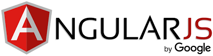

<!-- FAQ Modal -->

<div id="faqModal" class="modal fade" tabindex="-1" role="dialog">
<div class="modal-dialog modal-lg">

<!-- Modal content-->
<div class="modal-content">
<div class="modal-header">
<button type="button" class="close" data-dismiss="modal">&times;</button>
<h4 class="modal-title">Frequently Asked Questions</h4>
</div>
<div class="modal-body">
<p>My name is Doyin Elugbadebo. I am a Full Stack Developer and an Information Systems Practitioner based in Lagos, Nigeria. 
</p>

<p>Click on the buttons to open the collapsible content.</p>

<button class="accordion">Question 1</button>
<div class="panel-accordion">
<p>Lorem ipsum dolor sit amet, consectetur adipisicing elit, sed do eiusmod tempor incididunt ut labore et dolore magna aliqua. Ut enim ad minim veniam, quis nostrud exercitation ullamco laboris nisi ut aliquip ex ea commodo consequat.</p>
</div>

<button class="accordion">Question 2</button>
<div class="panel-accordion">
<p>Lorem ipsum dolor sit amet, consectetur adipisicing elit, sed do eiusmod tempor incididunt ut labore et dolore magna aliqua. Ut enim ad minim veniam, quis nostrud exercitation ullamco laboris nisi ut aliquip ex ea commodo consequat.</p>
</div>

<button class="accordion">Question 3</button>
<div class="panel-accordion">
<p>With an industry experience of more than 5 years, I have been involved in various designs, development and deployment of high front and backend solutions using range of latest internet technologies (Please visit Here for my detailed qualities and deployed projects). I particularly enjoy the subtle power of Laravel (a PHP framework), the magics of Ruby on Rails (RoR) and the constructive power of the Django & Flask frameworks. I am also a strong advocate of AngularJS, Ember.JS, Vue.JS and the React JavaScript Frameworks; - in combination with Apollo, GraphQL and Redux state management libraries. In the mobile domain, I have deployed insightful app projects on the Android and IoS platfroms, using Android-Java and DOM-bridged frameworks in the likes of ReactNative, PhoneGaps, C# (on Xamarin-Studio) and Cordova/Ionic Frameworks. Follow this direct link to my apps projects.</p>
</div>

<button class="accordion">Question 4</button>
<div class="panel-accordion">
<p>Lorem ipsum dolor sit amet, consectetur adipisicing elit, sed do eiusmod tempor incididunt ut labore et dolore magna aliqua. Ut enim ad minim veniam, quis nostrud exercitation ullamco laboris nisi ut aliquip ex ea commodo consequat.</p>
</div>

<button class="accordion">Question 5</button>
<div class="panel-accordion">
<p>Lorem ipsum dolor sit amet, consectetur adipisicing elit, sed do eiusmod tempor incididunt ut labore et dolore magna aliqua. Ut enim ad minim veniam, quis nostrud exercitation ullamco laboris nisi ut aliquip ex ea commodo consequat.</p>
</div>

<button class="accordion">Question 6</button>
<div class="panel-accordion">
<p>With an industry experience of more than 5 years, I have been involved in various designs, development and deployment of high front and backend solutions using range of latest internet technologies (Please visit Here for my detailed qualities and deployed projects). I particularly enjoy the subtle power of Laravel (a PHP framework), the magics of Ruby on Rails (RoR) and the constructive power of the Django & Flask frameworks. I am also a strong advocate of AngularJS, Ember.JS, Vue.JS and the React JavaScript Frameworks; - in combination with Apollo, GraphQL and Redux state management libraries. In the mobile domain, I have deployed insightful app projects on the Android and IoS platfroms, using Android-Java and DOM-bridged frameworks in the likes of ReactNative, PhoneGaps, C# (on Xamarin-Studio) and Cordova/Ionic Frameworks. Follow this direct link to my apps projects.</p>
</div>

</div>
<div class="modal-footer">
<button type="button" class="btn btn-default" data-dismiss="modal">Close</button>
</div>
</div>
</div>
</div>


<!-- Community Services -->

<div id="commservModal" class="modal fade bs-example-modal-lg" tabindex="-1" role="dialog">
<div class="modal-dialog modal-lg">
<div class="modal-content">
<div class="modal-header">
<button type="button" class="close" data-dismiss="modal" aria-hidden="true">&times;</button>
<h3 class="modal-title" style = "color: purple; font-size: 22px;">List of Community Services</h3>
</div>
<div class="modal-body">
<div class = "text-center">



</br>
All source codes available on <a href = "https://www.github.com/eslintpurity" target = "_blank">Github</a>
</div>

#### 

### Community services

Please find links to various tutorials I write online depending o your area(s) of interest. Visit here => http://www.eslintpurity.com to view the ones hosted on this site 

<div class  "container">
<div class = "row">
<div class = "col-md-4"> http://www.talkingmachines.com</div> <div class = "col-md-8">curated tutorials on machine learning and big data analytics</div>
</div>
<div class = "row">
<div class = "col-md-4">http://www.eslintpurity.com</div> <div class = "col-md-8">curated tutorials on web technologies and best practices</div>
</div>
<div class = "row">
<div class = "col-md-4">http://www.mobileappsdev.com</div><div class = "col-md-8"> curated tutorials on mobile apps development</div>
</div>
<div class = "row">
<div class = "col-md-4">http://www.masterydatascience.com</div><div class = "col-md-8"> curated tutorials on predictive analytics and GIS</div>
</div>
<div class = "row">
<div class = "col-md-4">http://www.bisanalytics.com</div><div class = "col-md-8">curated tutorials on business intelligence and GIS</div>
</div>
<div class = "row">
<div class = "col-md-4">http://www.animeengine.com</div><div class = "col-md-8"> curated tutorials on web animations</div>
</div>
<div class = "row">
<div class = "col-md-4">http://www.medium/doyin.com</div><div class = "col-md-8"> combined tutorials on my interests including cloud computing, machine learning, big data analytics, animation and geographic information systems</div>
</div>
</div>
</div>
<div class="modal-footer">
<button type="button" class="btn btn-default" data-dismiss="modal">Cancel</button>
<button type="button" class="btn btn-primary" data-dismiss="modal">OK</button>
</div>
</div>
</div>
</div>


<!-- Chicken and Egg problem Summary -->

<div id="chiceggModal" class="modal fade" tabindex="-1" role="dialog">
<div class="modal-dialog modal-lg">

<!-- Modal content-->
<div class="modal-content">
<div class="modal-header">
<button type="button" class="close" data-dismiss="modal">&times;</button>
<h4 class="modal-title">Chicken and Egg Conumdrum Summary</h4>
</div>
<div class="modal-body">

```{r, eval=FALSE}
if(egg){
  Start programming with javascript cos its constantly proving to be the future. Compliment this with good CSS
  framework(s); adding versioning as your magical matchbox.
}
if(chicken){
  Bunch to choose from - PHP, Ruby on Rails, CMS and Machine Learning.  
}
else{
  Fly to heaven
}
yeah you heard that right! yo dawg!!
```


<p style = "font-weight:bold;">Those chunks for this simple solution? Are programmers the most sane or most insane?? what is sanity???</p>

yo dawg! I heard you're considering a career in programming, so I programmed a program for you so see how a program is programmed.

<div class = "text-center">


</div>

</div>
<div class ="alert alert-danger text-center" style = "font-size: 18px; margin-left:2%; margin-right:2%;">#programLUSION</div>
<div class="modal-footer">
<button type="button" class="btn btn-default" data-dismiss="modal">Close</button>
</div>
</div>


<!-- Contact Modal -->

<div id="contactModal" class="modal fade" tabindex="-1" role="dialog">
<div class="modal-dialog">

<!-- Modal content-->
<div class="modal-content">
<div class="modal-header">
<button type="button" class="close" data-dismiss="modal">&times;</button>
<h4 class="modal-title">Contact</h4>
</div>
<div class="modal-body">

<div class = "alert alert-warning text-center" style = "margin-top: 1%;"><p class="lead" style = "color: purple;">Need an <span style = "color: black;">expert-freelancer or a remote developer</span> in web & mobile technologies?, predictive analytics or machine learning solutions? then you've chosen well.</p></div>

<div class="form-container">

<p style = "font-size: 14px; color: purple;">Kindly leave a message below. I'll get back to you at the earliest. Thanks</p>

<form name = "contacts" action="feedback.html">

<label for="name">Full Name*</label>
<span class="input-group-addon" id="sizing-addon1">
<span class="glyphicon glyphicon-user"></span><input type="text" id="name" name="name" placeholder="Your name.." required></span>

<label for="email">E-mail*</label>
<span class="input-group-addon" id="sizing-addon1">
<span class="glyphicon glyphicon-envelope"></span><input type="text" id="email" name="email" placeholder="Your email address.." required></span>

<div class = "row">
<div class = "col-lg-6 col-md-6">
<label for="reasons">Reasons</label>
<span class="input-group-addon" id="sizing-addon1">
<span class="glyphicon glyphicon-cog"></span>
<select id="reasons" name="reasons">
<option value="web">Web Development</option>
<option value="app">Mobile Apps</option>
<option value="bis">Business Intelligence Solutions</option>
<option value="automation">Automation</option>
<option value="docker">Dockering</option>
<option value="deployment">Deployment</option>
</select>
</span>
</div>
<div class = "col-lg-6 col-md-6">
<label for="phone">Phone No*</label>
<span class="input-group-addon" id="sizing-addon1">
<span class="glyphicon glyphicon-phone"></span><input type="text" id="phone" name="phone" placeholder="Your phone number.." required></span>
</div>

</div>

<label for="subject">Subject</label>
<textarea id="subject" name="message" placeholder="Write something.." style="height:200px"></textarea>

<input type="submit" name="submit" value="Submit Your Message →">

</form>
</div>

<div class="row">
<div class="col-md-12">
<p class="text-muted"><strong>*</strong> These fields are required. Contact form template by <a href="http://bootstrapious.com" target="_blank">Bootstrapious</a>.</p>
</div>
</div>

</br></br>

<div class="row">
<div class="col-lg-12 col-md-12" style = "font-size: 14.5px;">
<p><i class="fa fa-home" aria-hidden="true"></i>  Nnamdi Mbadiwe Building, Victoria Island, Lagos, Nigeria</p>
<p><i class="fa fa-globe" aria-hidden="true"></i> http://www.krystalcode.com, http://www.beautifulmind.github.io</p>
<span> Download <span style = "color: blue;"><a href="#" data-toggle="tooltip" title="Hooray!ts a business strategic mind tool  Tooltips must be initialized with jQuery: select the specified element and call the tooltip() method.

The following code will enable all tooltips in the document:">Chicken and Egg App</a> </span>→ <a href = "http://www.google.store/chicken-and-egg-app/"></a> <a href = "http://www.google.store/chicken-and-egg-app/"></a></span>

component.io  750MB	N500	*418#
https://www.tutorialrepublic.com/
https://stackoverflow.com/jobs/remote-developer-jobs
</div>
</div>


</br></br>

</div>
<div class="modal-footer">
<button type="button" class="btn btn-default" data-dismiss="modal">Close</button>
</div>
</div>
</div>
</div>


<!-- Ticket Modal -->
<div id="ticketModal" class="w3-modal">
<div class="w3-modal-content w3-animate-top w3-card-4">
<header class="w3-container w3-teal w3-center w3-padding-32"> 
<span onclick="document.getElementById('ticketModal').style.display='none'" 
class="w3-button w3-teal w3-xlarge w3-display-topright">×</span>
<h2 class="w3-wide"><i class="fa fa-suitcase w3-margin-right"></i>Tickets</h2>
</header>
<div class="w3-container">
<p><label><i class="fa fa-shopping-cart"></i> Tickets, $15 per person</label></p>
<input class="w3-input w3-border" type="text" placeholder="How many?">
<p><label><i class="fa fa-user"></i> Send To</label></p>
<input class="w3-input w3-border" type="text" placeholder="Enter email">
<button class="w3-button w3-block w3-teal w3-padding-16 w3-section w3-right">PAY <i class="fa fa-check"></i></button>
<button class="w3-button w3-red w3-section" onclick="document.getElementById('ticketModal').style.display='none'">Close <i class="fa fa-remove"></i></button>
<p class="w3-right">Need <a href="#" class="w3-text-blue">help?</a></p>
</div>
</div>
</div>


<!-- Testing contacts Modal -->
<div id="contactsModal" class="w3-modal">
<div class="w3-modal-content w3-animate-top w3-card-4">
<header class="w3-container w3-teal w3-center w3-padding-32"> 
<span onclick="document.getElementById('contactsModal').style.display='none'" 
class="w3-button w3-teal w3-xlarge w3-display-topright">×</span>
<h2 class="w3-wide"><i class="fa fa-suitcase w3-margin-right"></i>Tickets</h2>
</header>
<div class="w3-container">

<p style = "font-size: 14px; color: purple;">Kindly leave a message below. I'll get back to you at the earliest. Thanks</p>

<form name = "contacts" action="feedback.html">

<label for="name">Full Name*</label>
<span class="input-group-addon" id="sizing-addon1">
<span class="glyphicon glyphicon-user"></span><input type="text" id="name" name="name" placeholder="Your name.." required></span>

<label for="email">E-mail*</label>
<span class="input-group-addon" id="sizing-addon1">
<span class="glyphicon glyphicon-envelope"></span><input type="text" id="email" name="email" placeholder="Your email address.." required></span>

<div class = "row">
<div class = "col-lg-6 col-md-6">
<label for="reasons">Reasons</label>
<span class="input-group-addon" id="sizing-addon1">
<span class="glyphicon glyphicon-cog"></span>
<select id="reasons" name="reasons">
<option value="web">Web Development</option>
<option value="app">Mobile Apps</option>
<option value="bis">Business Intelligence Solutions</option>
<option value="automation">Automation</option>
<option value="docker">Dockering</option>
<option value="deployment">Deployment</option>
</select>
</span>
</div>
<div class = "col-lg-6 col-md-6">
<label for="phone">Phone No*</label>
<span class="input-group-addon" id="sizing-addon1">
<span class="glyphicon glyphicon-phone"></span><input type="text" id="phone" name="phone" placeholder="Your phone number.." required></span>
</div>

</div>

<label for="subject">Subject</label>
<textarea id="subject" name="message" placeholder="Write something.." style="height:200px"></textarea>

</form>

<button class="w3-button w3-block w3-teal w3-padding-16 w3-section w3-right"><input type="submit" value="Submit Your Message →"> <i class="fa fa-check"></i></button>

<p class="w3-right">Need <a href="#" class="w3-text-blue">help?</a></p>
</div>
</div>
</div>


<!-- Hire Me Modal -->
<div id="hireModal" class="w3-modal">
<div class="w3-modal-content w3-animate-top w3-card-4">
<header class="w3-container w3-blue w3-center w3-padding-32"> 
<span onclick="document.getElementById('hireModal').style.display='none'" 
class="w3-button w3-b w3-xlarge w3-display-topright">×</span>
<h2 class="w3-wide"><i class="fa fa-plane w3-margin-right"></i>Why Hire Me?</h2>
</header>
<div class="w3-container">
<div style = "padding: 15px;">


#### why hire me?

1. Candidate must be a professional in Systems Application Development.
2. Typical of my intrinsic style, I possess a vibrant business and strategic planning skills, pedagogically sound and always     strive to render a clean impact in any project involved in.
3. Good Knowledge of Algorithms for solving different problems
4. Experience in Good CSS & Javascript, HTML5, Angular JS / Jquery/ React, Electron, d3js
5. Experience authoring UI style guides for new titles to ensure product consistency
6. Rapid Prototyping and wireframes (e, OmniGraffle, Visio, Balsamiq)
7. Familiar Web Performance & Debugging Tools”
8. Possession of creative flair, versatility, conceptual/visual ability and originality
My web services mantra is delivering *secured rich Internet applications* by adopting latest web practices of *Test Driven Development (TDD), MVC/MVVM architectural design pattern and material design.*

</div>

<hr class = "light">
<button class="w3-button w3-red w3-section" onclick="document.getElementById('hireModal').style.display='none'">Close <i class="fa fa-remove"></i></button>
<p class="w3-right">Learn more about <a href="file:///C:/Projects/GitHub/krystallux.github.io/about.html#skills" class="w3-text-blue">my skills</a></p>
</div>
</div>
</div>


<!-- Subscription Modal -->
<div id="subscribeModal" class="w3-modal">
<div class="w3-modal-content w3-animate-top w3-card-4">
<header class="w3-container w3-blue w3-center w3-padding-32"> 
<span onclick="document.getElementById('subscribeModal').style.display='none'" 
class="w3-button w3-b w3-xlarge w3-display-topright">×</span>
<h2 class="w3-wide"><i class="fa fa-plane w3-margin-right"></i>Tutorial Subscription</h2>
</header>
<div class="w3-container">
<div>
<h4 style="color: red; font-size: 16px;">Subscribe for my weekly tutorials and links on various trends in technologies.</h4>

<div class="input-group">
<input type="text" class="form-control" placeholder="Enter your e-mail...">
<span class="input-group-btn">
<button class="w3-button w3-black w3-margin-bottom" onclick="document.getElementById('ticketModal').style.display='block'">Buy Tickets</button>
</span>
</div><!-- /input-group -->

</div>

<hr class = "light">
<button class="w3-button w3-red w3-section" onclick="document.getElementById('hireModal').style.display='none'">Close <i class="fa fa-remove"></i></button>
<p class="w3-right">Learn more about <a href="file:///C:/Projects/GitHub/krystallux.github.io/about.html#skills" class="w3-text-blue">my skills</a></p>
</div>
</div>
</div>